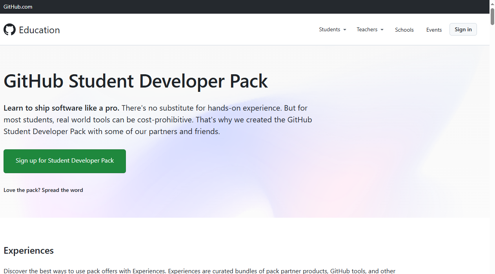
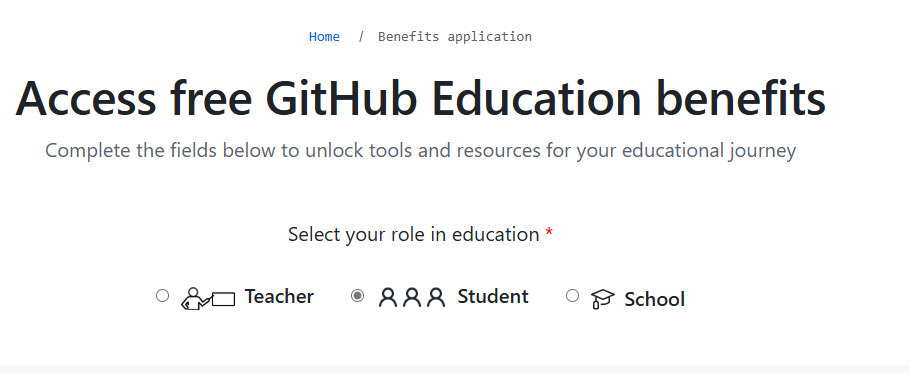
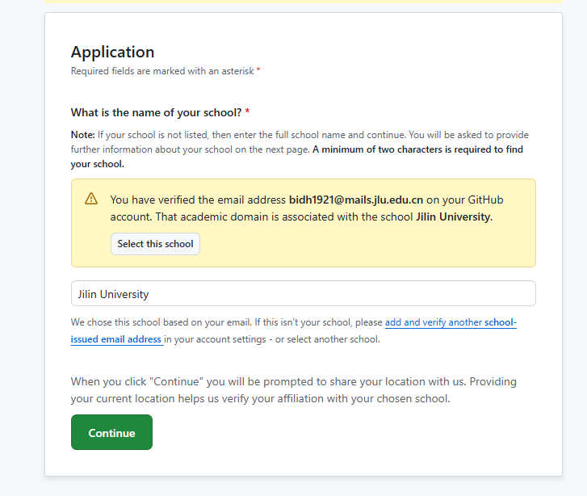
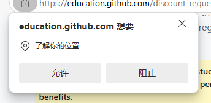
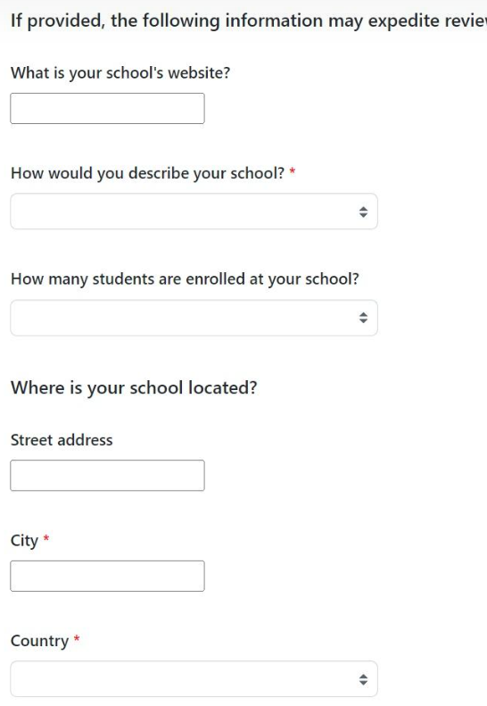
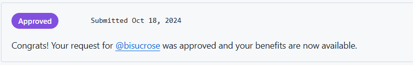
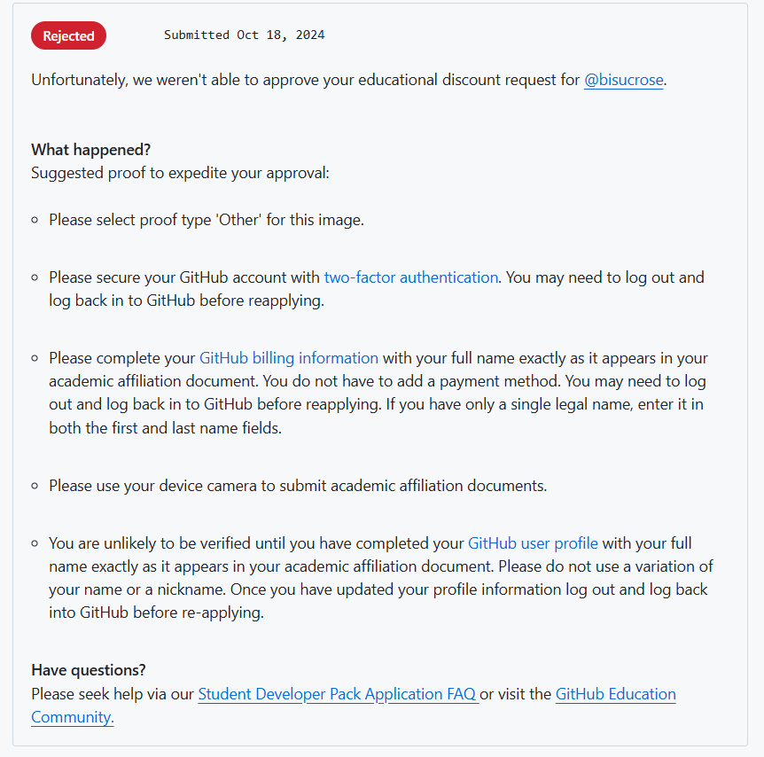

# GitHub Education Pack 白嫖教程

## 关于GitHub学生权益

Github学生包是GitHub为了鼓励高校学生的开发而设立的免费权益。有了这个，你就可以享受到GitHub提供的诸多权益，同时还可以获得Github的“学生认证”（类似于中国大陆境内的学信网验证，支付宝学生身份验证，微信学生身份验证之类的东西），可以很方便地白嫖到很多境外学习包资源。

目前Github官方提供的权益有（仅列出了我觉得比较有用的东西）：Github Pro（更多private仓库空间）Copilot（代码AI），DigitalOcean，JetBrain的professional权益，Namecheap的.me域名（一年），.tech的一年免费域名，Bootstrap Studio，1Password密码管理器，Arduino官网的教程和折扣。

目前不确定是否可以使用的权益：Azure一年免费B1s服务器和$100优惠券（我第一年申请的时候还有，但是现在好像不行了）；NAME.com的域名（无限跳转重定向）。

## 申请条件

> - 目前就读于正规大学或学信网可以开出来文凭证明的学校
> - 有一个可以证明上述身份的文件
> - **学校附近的定位（这个很重要）**
> - 网络允许的条件下，尽量使用校园网，不要挂梯子。

## 准备材料

>- 教育邮箱(最好是有)
>- 以下材料至少有其中一个，且最好是英文版
>
>1. 带有学校名称，学校公章，个人信息及有效期的学生证
>2. 带有学校名称，入学日期和学校公章的录取通知书（推荐）
>3. 带有学校名称，日期和公章的奖学金证明或者其他奖项证明等（本人使用这个文件秒过，带英文）
>4. 学信网的个人学籍报告（可以使用浏览器自动翻译）
>5. 学校出具的在读证明（需要公章）

## 申请方法

1. 点击 [GitHub Student Developer Pack - GitHub Education](https://education.github.com/pack) 进入GitHub Student Developer Pack官网，点击 Sign up for Student Developer Pack. 

   

   

2. 选择你的身份，这里选择Student

   

3. 选择你的邮箱，如果你有edu邮箱一定要用edu邮箱（如本人为@mails.jlu.edu.cn），可以大大提高注册成功率。如果没有列出来可以点击Add来添加。

4. 填写学校的名字，英文全称。比如我这里填写 Jilin University （有些学校可能需要填写以前的全称，如BUAA全称似乎填写Beihang University会无法识别，需要填写Beijing University of Aeronautics and
   Astronautics）

   

5. 在获取定位的时候选允许（请勿使用360浏览器等“隐私保护浏览器”）

   

6. 填写你想拿这个做什么，可以直接填写

   > I wanna code and make contributions to our community.

7. 上传证明材料，在下面的proof type里面选择你的证明材料类型，学信网的证明可以选择other

8. 如果挂了VPN或者其他的原因导致你的定位不在学校，在这一步可能会问你“why are you not on campus”，挂了VPN的直接选择I am using a VPN即可，然后上传clash截图即可。如果其他原因请自行解决（会大大降低成功率）

9. 填写学校信息

   

10. 点击提交申请即可，之后你可以在 [Get your GitHub benefits - GitHub Education](https://education.github.com/discount_requests/application) 查看你的申请状态，一般申请以后1-2天就可以通过。通过了以后就会显示如下内容：

    

11. 之后可以在 [GitHub Student Developer Pack - GitHub Education](https://education.github.com/pack) 界面中下滑按照指示领取相应的权益。

## 问题解决

> 提交不到2分钟就接到了一个回复邮件上面说没有通过。
>
> **解决方法**：按照邮件指引或者前往 [Get your GitHub benefits - GitHub Education](https://education.github.com/discount_requests/application) 查看你的申请状态，应该是这个样子的。
>
> 
>
> 请按照上面的每一条指引修改。例如我这个需要使用：
>
> - 上传的图像种类应该选择Other。
> - 必须设置2FA（两步验证），点击链接设置即可。
> - 使用设备摄像头来拍证书或者学生证而不是上传。
> - 在自己的简介信息里面直接把profile名称设置成自己证书上的真名，然后退出重登一遍。
>
> 经验证上面的并不需要全部达成，比如我就只设置了2FA和把自己的名字改成了自己真名，就成功了。
>
> **总之跟着他说的一步一步修改就可以了**

​    

​    

