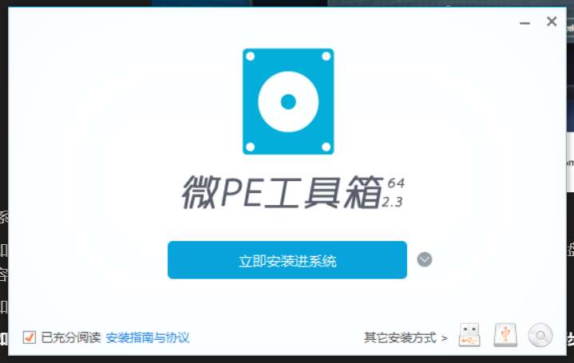
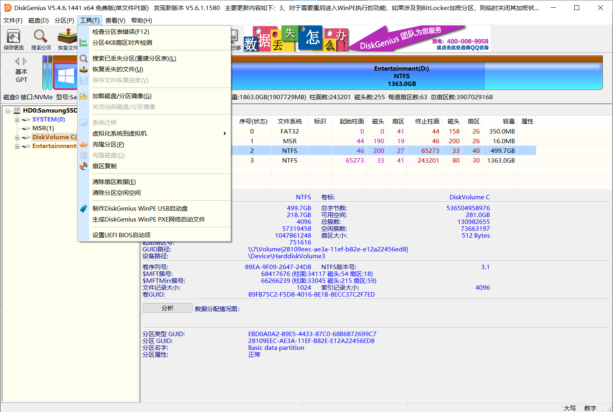
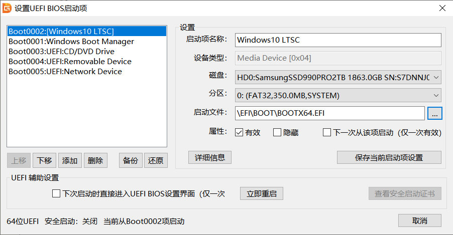
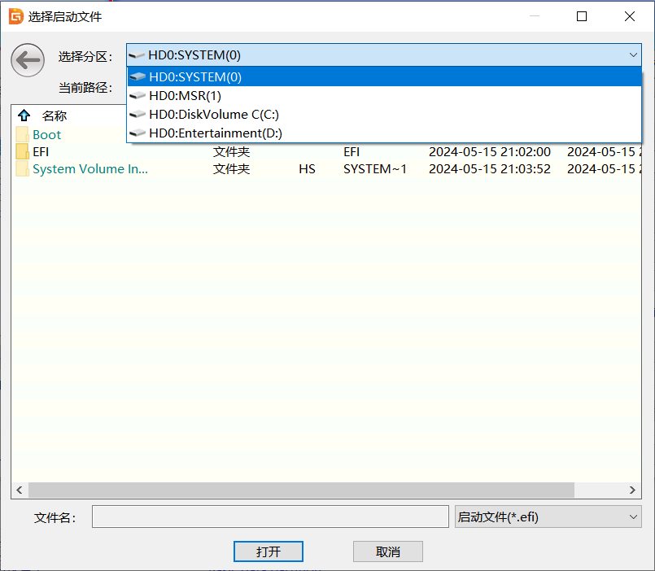
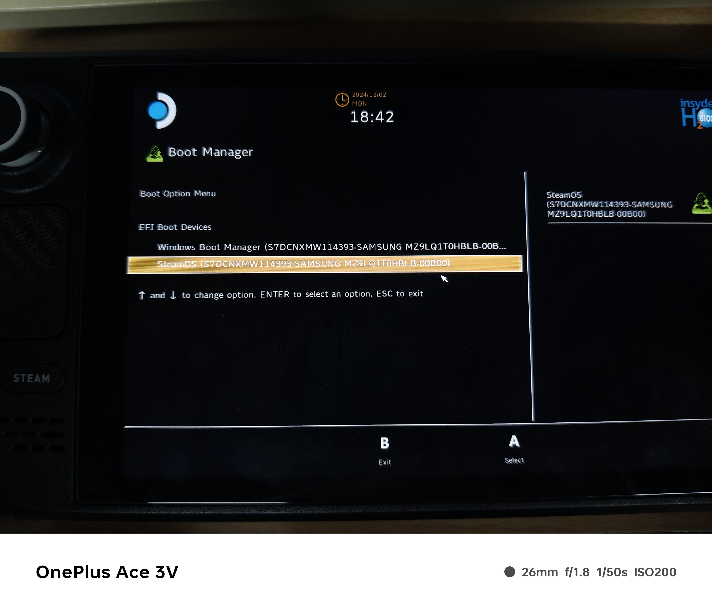

# SteamDeck单盘双系统安装指南

## 前面的碎碎念

### 1. 两次购入与两次卖出

SteamDeck是我两次入手又出手的设备，第一次是疫情期间在Steam的美区上面直接购入，经转运四方转运回中国，改了SN740的1TB硬盘；随后黄牛炒的很高，以4200元出手，赚了一大笔。后来等到疫情结束，价格下来了不少，我就物色了一个改好1TB的，3000入手，拿来以后并没怎么玩游戏，而是经常带到实验室去连接大屏幕当小主机使用。后来把自己的游戏本换成了轻薄本+外接显卡的方案，再加上SteamDeck已经推出3年，性能略显颓势~~（原神已经全高画质无法满帧运行）~~，~~原神启动器~~就没了用武之地，因此在今年以2450的价格给出掉了。

### 2. SteamOS发展现状

SteamOS是基于ArchLinux开发的专用于SteamDeck的操作系统，有两种模式：桌面模式（KDE Plasma）和掌机模式（Steam大屏控制）。整个Linux系统使用Proton转译，从而实现在Linux系统上面运行Windows游戏（也有一些游戏原生支持Linux，效率会高一些）。但是整体而言，兼容性还是不如Windows，因此SteamDeck推出一段时间以后G胖也知道自己的系统做的不太行，于是给了Windows系统的驱动。G胖承诺 SteamOS 3 会优化Proton和双系统引导，但是Valve长期君主离线，看样子已经把 SteamOS 3 鸽了，双系统引导就迟迟未能上线。

### 3. 当下的双系统方案

当下的双系统方案普遍采用TF卡安装Windows，SteamOS安装在SSD里面。这样做的好处是：

> 1. Windows可以打包成已经安装好的镜像包，可以使用Balena Etcher直接烧录进TF卡
> 2. 集成了各个驱动和组件，便于商家远程操作，或者小白也可以简单刷好系统并开箱即用
> 3. Windows和SteamOS分别存储在不一样的物理磁盘上，不会相互干扰，不容易因为误操作而导致两个系统全部损坏
> 4. Windows系统出bug便于修理
> 5. 便于制作双系统引导

但是这样的方案会导致：

> 1. Windows的磁盘读写要求较高，将Windows安装在TF卡里面会严重损失性能，而SteamOS的性能要求较低。这样倒反天罡的做法不太恰当。
> 2. 之所以不将SteamOS写入TF卡，而将Windows写入TF卡，是因为SteamOS自带的刷写程序默认会将SteamOS刷入本地硬盘，没有其他的选项。技术上可以将SteamOS刷入TF卡，但是每当Windows应用更新的时候就会将SteamOS的引导抹去
> 3. 如果不使用Windows整合包刷入TF卡，那么在安装Windows的时候是无法显示TF卡的，使用Windows To Go方式直接部署的话会因为没有驱动而无法启动。~~对于我这种有电子洁癖的人来说，不从格式化后纯净的系统开始自己部署的系统不是一个好系统。~~
> 4. 不能自由的选择自己想要的Windows版本
> 5. ~~还得买一个128GB的TF卡，我不想买~~

其中第一条的影响最为恶劣，系统的速度也会间接影响游戏的运行速度。

## 单盘双系统刷入教程

1. 首先从 [Steam 客服 :: Steam Deck 恢复指示说明](https://help.steampowered.com/zh-cn/faqs/view/1b71-edf2-eb6d-2bb3) 下载steamdeck_recovery.img，并按照其要求烧录镜像。为了查看方便，引用如下

   > ## Steam Deck 恢复指示说明
   >
   > 1. [点击此处](https://store.steampowered.com/steamos/download/?ver=steamdeck&snr=100601___)下载恢复映像。
   >
   > 2. 准备一个装有恢复映像的 USB 启动盘 （容量至少为 8GB）：
   >
   >    - 在 **Windows** 上，我们建议使用 [Rufus 实用工具](https://steamcommunity.com/linkfilter/?u=https%3A%2F%2Frufus.ie%2Fen%2F)。 选择恢复文件并将其写入 U 盘（此操作将格式化该 U 盘里的内容）。 完成后，选择“关闭”并弹出 U 盘。
   >
   >    - 在 **macOS** 上，您可以使用 [Balena Etcher](https://steamcommunity.com/linkfilter/?u=https%3A%2F%2Fwww.balena.io%2Fetcher%2F)，将恢复文件写入您的 U 盘。
   >
   >    - 在 **Linux** 上，您也可以使用 [Balena Etcher](https://steamcommunity.com/linkfilter/?u=https%3A%2F%2Fwww.balena.io%2Fetcher%2F) 将恢复文件写入您的 U 盘；或者如果您愿意，您可以直接从命令行执行此操作：
   >
   >      ```shell
   >      bzcat steamdeck-recovery-4.img.bz2 | sudo dd if=/dev/stdin of=/dev/sdX oflag=sync status=progress bs=128M
   >      ```
   >
   >      （将 /dev/sdX 设为您插入的 USB 设备）
   >
   > 3. 将启动盘通过 USB-C 适配器或集线器插入 Steam Deck。
   >
   > 4. 如果您的 Steam Deck 尚未关闭，请将其关闭。 按住降低音量键并按下电源键，听到提示音后放开降低音量键，机子会启动并进入“Boot Manager”（启动管理）界面。
   >
   > 5. 在“Boot Manager”界面上，选择从“EFI USB Device”（您的 USB 启动盘）启动。
   >
   > 6. 启动时屏幕会变暗，稍等片刻。
   >
   > 7. 启动后，您将被带到桌面环境，您可以使用触控板及扳机键导航。

2. 启动完成以后，选择“Reimage SteamDeck”，重新刷写SteamDeck（此操作将会清空你的整个硬盘），会出现以下界面。确认无误后选择Proceed。


3. 取决于你的U盘速度，整个过程可能持续1分钟到30分钟不等，终端界面应当显示进度。如果多次失败，请检查你下载的镜像文件是否存在错误。刷写完成以后会显示如下信息，询问是否要重启，这里选择Cancel（不重启）

   

   

4. 点击左下角开始菜单，在“system”文件夹里面找到KDE Partition Manager（分区助手）

   

5. 点开以后如图所示，选择最后那一大块大分区，点击Resize/Move（重新划分大小）

   

6. 如图所示，此分区为SteamOS的分区大小，使用鼠标拖动边界，将SteamOS分区重新划分大小（自己视情况而定，建议40GB+）

   

7. 划分好大小后点击OK，然后点击左上角Apply，出现下图界面，点击Apply Pending Operation（应用操作）

   

8. 操作完成以后，点击刚刚划分过分区的剩余地方，点击New，出现以下界面

   

9. 文件系统（File System）选择NTFS，大小分两种情况：
   - 如果你要做游戏库互通，即两个系统共用一个SteamLibrary文件夹：这个分区将是你的C盘，建议分区120GB。然后重复此操作创建D盘，容量为剩下的所有容量。
   - 如果你不用游戏库互通，直接将剩下的容量全部分给Windows即可。
   - **如果你觉得这里可以不分盘，在后续的Windows安装中直接选择“未分配的空间”，请移步文末的“问题解决”**

10. 分好盘以后重启进入SteamOS，SteamOS需要下载一小会儿，利用这个时间我们来刷写Windows。

11. 下载Windows PE和你要安装的WindowsISO包，这里建议WindowsPE选用 [微PE工具箱 - 超好用的装机维护工具](https://www.wepe.com.cn/) ，免费，还没有广告，不会植入各种乱七八糟的卫士程序（截至2024年12月13日），Windows包可以在 [MSDN, 我告诉你 - 做一个安静的工具站 ](https://msdn.itellyou.cn/) 上面下载

12. 使用WEPE安装程序，选择右下角的第一个选项，将PE安装到U盘，**注意选好盘**（来自一不小心把自己有数据的盘抹掉的作者的忠告）

    

13. 将Windows安装镜像ISO拷入WEPE分区根目录，然后插入SteamDeck，按住开机+电源减开机，选择USBXXXXX（总之就是除了SteamOS的另外一个选项）

14. 开机以后触屏可以使用，选择WindowsNT安装器，选择ISO镜像，安装分区选择刚刚第9步分的Windows分区，引导分区应该已经选好了。如果实在不会用请参考 [WinNTSetup 使用教程(二创) “绕过”TPM2.0、解决“安装不了win7”等最佳方式 - 哔哩哔哩](https://www.bilibili.com/opus/514275372524964050) 

15. 等待解压完成，关机，拔掉设备以后再次开机。

16. Windows会自己安装，不用管。安装完以后Windows默认是竖屏，在显示设置里面可以调成横屏

17. 插上WEPE的盘，重新开机引导。此时**SteamOS**应该已经消失，剩下**Windows Boot Manager**和你的USB设备

18. 打开DiskGenius，在工具栏里面找到“**设置UEFI BIOS启动项**”

    

19. 呈现如下界面：

    

20. 点击添加：

    

21. 选择HD0:SYSTEM(0) 或者有的叫做ESP(0) EFI(0)等

22. 找到EFI->SteamOS文件夹，点进去有一个以.efi结尾的文件，“**右键点击**！！！”，下面文件名应该会出现这个efi文件的名字，点击打开

23. 启动项会多一个 New Boot Entry，在启动项名称那里给它重命名成SteamOS，并上下移动（你想让按下开机键Windows启动就把Windows放上面，想让SteamOS直接启动就把SteamOS放上面，不要把你的U盘放上面！！！）

24. 关掉此界面，再关掉diskgenius，关机

25. 按住电源和音量减，出现以下界面，双系统引导制作完成

    


## 问题解决

- 刷入SteamOS的时候卡死了：确保自己下载的时候网络环境良好，没有中断。
- DiskGenius设置UEFI的时候一直提醒请选择文件：请仔细阅读教程，右键点击efi文件（触屏操作为长按）
- 为什么我不能直接将ISO刷入U盘直接安装到空白的NTFS分区中：因为SteamOS的存在，EFI分区并不是空的，Windows无法识别EFI文件，就会报错，告诉你不能安装到这个磁盘上。也有可能是EFI分区只有260MB，安装Windows可能需要300MB
- 为什么不能不给硬盘分区，直接空出来让Windows自行创建Windows所需的所有分区：你会发现，即使你在第6步重新分配了SteamOS的分区大小，SteamOS在第一次启动的时候也会把你的Windows分区吞并掉。如果你不先启动SteamOS而直接开始安装Windows，SteamOS会在第一次启动的时候报错。

## 

## 附录：SteamDeck恢复映像的其他选项

> ## 恢复选项
>
> 在恢复环境中有四个不同的选项。
>
> - **Re-image Steam Deck（对 Steam Deck 重新映像）** - 将完全恢复出厂设置。所有用户信息、安装的游戏及应用，以及操作系统均会被清除并替换为原生 SteamOS。
> - **Clear local user data（清除本地用户数据）** - 将重新格式化 Steam Deck 上的主分区。这将删除已下载的游戏和存储在此 Deck 上的所有个人内容，包括系统配置。
> - **Reinstall Steam OS（重新安装 SteamOS）** - 将在尝试保留您的游戏和个人内容的同时，在 Steam Deck 上重新安装 SteamOS。
> - **Recovery tools（恢复工具）** - 将开启可以对 Steam Deck 的启动分区进行修改的提示。
