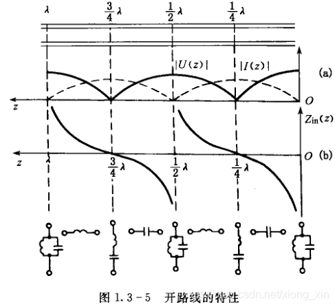
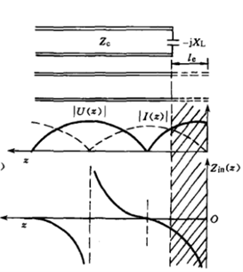
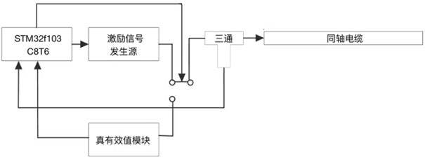
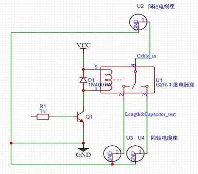
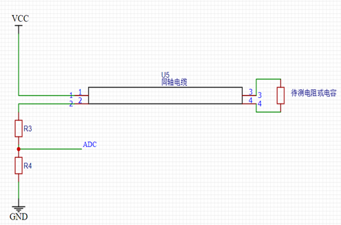
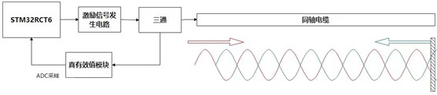
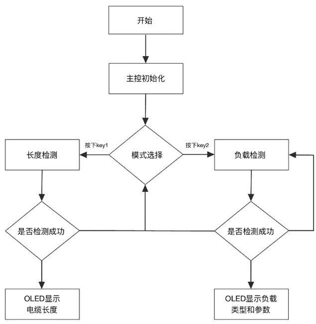
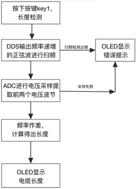

# 2022年全国大学生电子设计大赛B题思路

__同轴电缆长度与终端负载检测装置（B题）__，本文为该题提供思路，其内容基本与当年所提交论文一致。思路还不错，最终也有人使用我们这套方案得奖。所有硬件设计以及计算均为本人设计并推导，但由于最后器件不合规以及软件问题失利。这里也请大家引以为戒，不要只注重一个方面的完美。

## **摘要** 

本系统采用STM32F103RCT6作为主控控制器，以高频信号发生器作为激励信号输入同轴电缆，使用电磁场基本理论与基本电路分析基础求解得出电缆长度，终端所接器件类型，终端器件参数等，具有快速，方便，成本低廉的优势。

主要使用的器件以及模块有：STM32主控，AD9850，BNC、SMA接头，阻抗匹配器等。

长度识别部分主要采用终端开路的同轴电缆中电磁波发生全反射形成驻波的原理，再进行频率扫描使得波节与波腹沿电缆进行位移，从而在输入端的三通处测得波形峰值变化。再经过AD637真有效值转换芯片输出，经ADC采样后识别出波节位置所对应的频率差即可得出电缆总长度。系统采用差分的方法来减小误差。

阻容识别部分主要采用电容隔直通交的理论，通过测定始端电阻电压值的大小从而判断出器件类型，同时利用欧姆定律可以计算出阻值。

电容容值测量部分主要利用电磁场理论中输入段阻抗等效计算实现，通过测定电容等效导线长度结合入段阻抗计算式计算出电容容值。

**关键词：STM32F103RCT6、AD637、高频、电磁场基本理论，驻波，真有效值，入段阻抗，同轴电缆，差分**

## __目录__

[1  系统方案	1](#_Toc142156106)

[1\.1  电缆长度识别方式的论证与选择	1](#_Toc142156107)

[1\.2   电容电阻测量方式的论证与选择	1](#_Toc142156108)

[1\.3   控制系统的论证与选择	1](#_Toc142156109)

[2  系统理论分析与计算	2](#_Toc142156110)

[2\.1  电缆内驻波的分析	2](#_Toc142156111)

[2\.1\.1 终端开路时电缆内部驻波的分析	2](#_Toc142156112)

[2\.1\.2 加上电容以后内部驻波的分析（电容计算法）	2](#_Toc142156113)

[2\.1\.3 电阻电容的判断方式	2](#_Toc142156114)

[2\.2 电缆长度的计算	3](#_Toc142156115)

[2\.3 终端器件参数的计算	3](#_Toc142156116)

[2\.3\.1 电容器的参数计算	3](#_Toc142156117)

[2\.3\.2电阻的参数计算	4](#_Toc142156118)

[3  电路与程序设计	4](#_Toc142156119)

[3\.1电路的设计	4](#_Toc142156120)

[3\.1\.1系统总体框图	4](#_Toc142156121)

[3\.1\.2 激励信号发生电路系统设计	4](#_Toc142156122)

[3\.1\.3 信号检测及处理电路系统框图与电路原理图	4](#_Toc142156123)

[3\.1\.4电源	5](#_Toc142156124)

[3\.2程序的设计	5](#_Toc142156125)

[3\.2\.1程序功能描述与设计思路	5](#_Toc142156126)

[3\.2\.2程序流程	6](#_Toc142156127)

[4  测试方案与测试结果	6](#_Toc142156128)

[4\.1测试方案	6](#_Toc142156129)

[4\.2 测试条件与仪器	7](#_Toc142156130)

[4\.3 测试结果及分析	7](#_Toc142156131)

[4\.3\.1测试结果\(数据\)	7](#_Toc142156132)

[4\.3\.2测试分析与结论	7](#_Toc142156133)

## 1.系统方案

本系统主要可以分为以下几个部分：STM32主控，电缆长度识别部分，终端负载识别部分，阻抗匹配器部分和电源模块。下面分别论证这几个模块的选择。

### 1\.1 电缆长度识别方式的论证与选择

方案一：通过检测正向波与逆向波的相位差判断长度。此方案将导线内的入射波与反射波通过互感装置分离，形成两路行波，通过测量两路行波的相位差即可计算出电缆长度。此方案好处在于将两路分离，但是这也正是其难点。两个方向的波需要依靠互感装置分离导致电缆测量过程中引入了附加电感，使得波形特性出现漂移，且手绕电感导致长度难以标定，影响后续测量。故舍弃。

方案二：通过检测正向波与逆向波在电缆内直接叠加的驻波判断导线长度。此方案不分离导线内的入射波和反射波，而是让其在电缆内部直接叠加成驻波。通过测量驻波波节波腹的位置计算线缆长度。但由于线缆只能从始端测量，故需要使用频率变化来将位置参数转化为频率（波长）参数。

方案三：直接测试同轴电缆的电容值来判断导线长度。导线入段电容测试方法较易，但是由于电缆长度1000cm\-2000cm，其分布参数影响极大，线缆长度和电容不成正相关，因此难以标定。

综合以上三种方案，选择方案二。

### 1\.2 电容电阻测量方式的论证与选择

电容的测量方式有固定的套路，即在已测得线缆长度的条件下测得对应频率下电压的幅值与最大值之比即可测出所处驻波相位，由此即可计算得出电容容值。

电阻测量方案商榷如下：

方案一：使用直流恒流源加上ADC采样直接标定电阻阻值。此方法简单易行，但是由于需要切换电路，故电路复杂性会增加，整个系统不稳定因素增加。

方案二：使用高频信号测试驻波比从而确定失配度，由失配度可反向计算出电阻阻值。此方案计算繁琐，而且在高频状态下元件分布参数影响较大，测量误差可能较大。

方案三：使用AD5933模块直接测量电路参数。但是AD5933模块测量范围在本题要求之外，使用运算放大器调整参数过后测量精度较差。

综合以上三种方案，选择方案一。

### 1\.3 控制系统的论证与选择

方案一：使用Arduino。Arduino可以大大缩短开发时间，提升开发效率。但是由于其内部ADC默认采样频率较低，在高频环境中难以应用，故不采用。

方案二：使用STM32。STM32开发难度适中，且有HAL库支持便于移植驱动。为了解决上述AD采样精度低的问题，使用了时钟频率较高的STM32F103RCT6，且该型号单片机引脚较多便于后期拓展。

综合考虑采用STM32F103RCT6。

## 2系统理论分析与计算

### 2\.1  电缆内驻波的分析    

#### 2\.1\.1 终端开路时电缆内部驻波的分析

长线终端短路、开路或端接纯电抗负载时，由于反射系数Γ=1 ，所以入射波在终端都将被全反射。入射波与反射波叠加，沿线形成驻波分布，驻波比S=∞。

终端开路时沿线电压、电流振幅值和阻抗的分布如图所示。由图1可见终端为电压波腹点、电流波节点，阻抗为无穷大。

利用驻波的开路段永远是电压波腹点和相邻波节波腹的间距都是λ/2这个特性，我们可以通过调整波长λ的值使得波节与波腹的位置左右移动。随着频率的增加，波长不断减小，当波长减小至λ*=*4l时理论上输入端应当出现第一个零点，即波节位置移动至检测位置。继续缩小到λ=4/3l时出现第二个零点。但是若终端出现某些干扰，会导致整个驻波出现相移，即开路的终端不再是波腹位置，这样就会出现偏差。如果取两次的值作差就可以减小误差。

#### 2\.1\.2 加上电容以后内部驻波的分析（电容计算法）

上文提到过起始端接入纯电抗负载时，也会发生全反射。电容元件会对信号进行相移，驻波也随之相移，入段阻抗改变，如图2所示。因此电容容值可以等效成导线长度。通过测量导线的等效长度即可算出电容的值。具体推算过程如下文2\.3\.1所示。

#### 2\.1\.3 电阻电容的判断方式

利用电容隔直通交的特性，当末端接入的是电容器时，若向电缆内通入直流电，应无电流存在。若终端接入量级为数十欧的电阻，则电路则会产生明显的电流。对于直流电来讲，20m电缆的阻值可视为集总参数，从而规避掉了分布参数的复杂运算。

### 2\.2 电缆长度的计算  

利用作差可以很简单地求出导线的长度，由频率差计算导线长度的具体推导过程如下：

当第一个驻波波节到达电缆始端时，观测到最小幅值，此时记频率为f1，有：
$$
l=\frac{\lambda_1}{4}
$$
当第二个驻波波节到达电缆始端时记频率为f2：
$$
l=\frac{3\lambda_2}{4}
$$
联立以下基本物理学公式：  
$$
\lambda=\frac{u}{f}
$$

$$
c=\sqrt{\varepsilon_r\mu_r}u
$$

即可得到：
$$
l=\frac{u}{2(f_2-f_1)}=\frac{c}{2\sqrt{\varepsilon_r\mu_r}\Delta f}
$$
只需计算出f2-f1，即可由已知参数确定*l*的值

### 2\.3 终端器件参数的计算   

#### 2\.3\.1 电容器的参数计算

计算反射系数：
$$
\dot{\Gamma_L}=\frac{Z_0-jX_L}{Z_0+jX_L}
$$
代入电抗器件得到：
$$
|\dot{\Gamma_L}|=1
$$
则电压电流矢量形式可以表记为：
$$
\dot{U_Z}=\dot{U^+}(e^{-j\beta z}+\Gamma_Le^{j\beta z})
$$

$$
\dot{I_Z}=\frac{\dot{I^+}}{Z_0}(e^{-j\beta z}-\dot{\Gamma_L}e^{-j\beta z})
$$

其中，β为相位常数：

由终端开路的入段阻抗计算式
$$
\dot{Z_{in}}=Z_0\frac{Z_Lcos\beta l+Z_0sin\beta l}{Z_0cos\beta l+Z_Lsin\beta l}
$$
得：
$$
l_0=\frac{tan\frac{2\pi}{\lambda}}{\omega CZ_0}
$$
其中*l­0*就是电容的等效长度，可以由第二问的长度测量装置测得。

#### 2\.3\.2电阻的参数计算

由于采用直流分压的方法测试电阻，故电阻只需用欧姆定律分压计算即可，此处不再赘述。

## 3电路与程序设计

### 3\.1电路的设计

#### 3\.1\.1系统总体框图

系统总体框图如图3所示，

#### 3\.1\.2 激励信号发生电路系统设计

激励信号为3MHz~30MHz的连续扫频信号，由于频率较高，故采用DDS模块直接产生。由STM32主控向DDS发送频率相位等信息，DDS即可直接产生相应的波形作为激励信号。

#### 3\.1\.3 信号检测及处理电路系统框图与电路原理图

**1、阻容负载判断及电阻测量子系统电路**

三极管基极接入单片机IO接口控制继电器开关，R3R4之间接入单片机ADC测量电压值。

 

**2、电缆长度检测及电容容值测量子系统框图**

#### 3\.1\.4电源

电源部分由外部输入5V供电，可以从外部仪器电源接入，也可从单片机Type\-C接口接入。由于电路比较简单，此处不再详细说明。

### 3\.2程序的设计

#### 3\.2\.1程序功能描述与设计思路

1、程序功能描述

根据题目要求软件部分主要实现OLED的显示和使用ADC读取电压值对应频率值并处理。

1）键盘实现功能：开启电缆长度检测、负载类型及参数检测。

2）显示部分：显示工作状态，电缆长度，负载类型及其参数。

2、程序设计思路

设计DDS频率扫描函数，控制DDS输出频率变化的正弦信号；设计ADC采样模块，用于采集电缆内形成的驻波信号，与对应DDS频率建立关系求得电缆长度

#### 3\.2\.2程序流程

1、主程序流程图					

2、终端开路电缆长度测量子程序流程图

3、电容容值测量子程序流程

在已经测量完长度和判断过负载为电容的前提下，再次测量长度并计算出新的等效长度，套用2\.3\.1的公式即可计算出电容容值。

4、电阻阻值测量子程序流程

在已经测量完长度和判断过负载为电容的前提下，读取ADC的值，利用ADC读取的电压套用欧姆定律即可解出电阻阻值。套用时可结合长度修正电缆阻值。

## 4测试方案与测试结果

### 4\.1测试方案

本题软件主要负责产生波形，计算时间和频率差

1、硬件测试

硬件部分在和DDS联调测量之前使用高频信号发生器作为其激励源，经检波以后输入示波器观察一个周期内的极小值，并直接采用2\.2, 2\.3中所述算法计算出对应的长度、阻值或容值。

2、软件测试

软件控制DDS产生相应的定频波形与步进扫频波形，并用示波器观察生成状态。

3、硬件软件联调

通过样机对20m电缆进行检测，将20m电缆以半米为单位逐次剪短并用硬件电路测试，分别测试其长度、终端电阻值、终端电容值。通过所得长度结果，调节电介质常数，直到所得值稳定在目标值附近，误差最小时，开始对电容、电阻值进行测量，并对电容、电阻的系数进行调整，得到有效电容电阻值，并对以上数据记录，求得测量误差。

### 4\.2 测试条件与仪器

测试条件：测试条件：通过信号发生器对电缆进行验证测试，通过实验对前期理论进行验证，在测试后确认具体方案后，再设计硬件电路。

测试仪器：频谱分析仪，频率计，200MHz数字示波器，LCR测试仪，200MHz信号发生器，直流稳压电源。

### 4\.3 测试结果及分析

#### 4\.3\.1测试结果\(数据\)

由于测量数据较多，现摘录部分长度测量数据如下：

| **实际长度(m)** | **测量长度(m)** | 相对误差 |
| :-------------: | :-------------: | :------: |
|      19.00      |      18.98      |  -0.11%  |
|      18.00      |      18.06      |  0.33%   |
|      17.00      |      17.03      |  0.18%   |
|      16.00      |      16.08      |  0.50%   |
|      15.00      |      15.61      |  0.71%   |
|      14.00      |      14.54      |  0.28%   |
|       ……        |       ……        |    ……    |

#### 4\.3\.2测试分析与结论

根据测试结果，开路时测量长度在1000cm到2000cm之间电缆的误差绝对值均在1%以内，且检测时间大约为四秒；负载测量中，电阻测量值误差不大于10%，检测时间大约为四秒，电容测量值误差不大于7%，测量时间大约为四秒，由此可以得出以下结论：

1、最佳扫频测量值为3MHz\-30MHz，在此频率范围内扫频，可以获得已与测量的反射波；

2、同轴电缆长度、电阻、电容的测量值受到温度漂移影响，在室温正常变化范围内，误差不大于2%；

综上所述，本设计达到设计要求。

