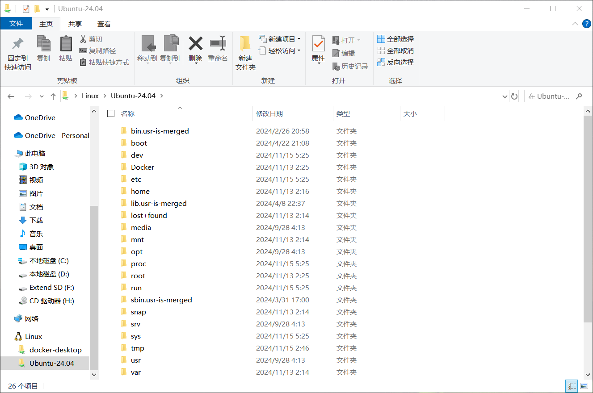

# WSL使用指南

## WSL的图形化文件管理

WSL2是有图形化文件管理界面的，在安装完WSL后在此电脑左边的导航栏里面应该有个Linux（如果没有可以输入 `\\wsl$`），就可以看到现在安装的发行版的文件了。（按照这个方法打开的目录和普通用户的权限是一样的）




## WSL中的GUI界面中文显示为方框/乱码

在安装了一些图形化界面后可能会出现缺少字体导致字体全是方框，无法正常显示。此为缺少字体导致

Ubuntu的字体存储在/usr/share/fonts目录下，精简安装的时候很多字体都被阉割了，可以把Windows里面的字体复制粘贴到Ubuntu里面。

```shell
sudo mkdir /usr/share/fonts/windows
sudo cp /mnt/c/Windows/Fonts/* /usr/share/fonts/windows
```

此后重启一下WSL应该就可以正常显示字体了。


## WSL在Linux里面运行wsl指令

在Linux系统环境下也可以直接执行wsl命令，只是需要输入 `wsl.exe`才能够执行

例如：

```shell
bisucrose@DESKTOP-F2U79D7:~$ wsl --update
wsl: command not found
bisucrose@DESKTOP-F2U79D7:~$ wsl.exe --update
正在检查更新。
已安装最新版本的适用于 Linux 的 Windows 子系统。
```


# WSL常用命令

下面只列出了一些常用的命令，更多的命令请自行查看文档

```shell
# 安装WSL并指定Linux发行版
wsl --install  # 默认安装Ubuntu
 --distribution <发行版名称>：指定安装的发行版
 --no-launch：安装后不自动启动
 --web-download：在线下载安装
 --inbox：使用Windows组件安装WSL（非Microsoft Store）
 --enable-wsl1：启用WSL 1组件
 --no-distribution：不安装任何发行版

# 查看在线可用发行版列表
wsl --list --online  # 别名：wsl -l -o

# 查看已安装的Linux发行版列表及状态
wsl --list --verbose  # 别名：wsl -l -v
 --all：列出所有发行版
 --running：仅列出当前运行的发行版
 --quiet：仅显示发行版名称

# 将指定发行版设置为WSL1或WSL2
wsl --set-version <发行版名称> <1/2>  # 切换WSL版本

# 设置WSL默认版本
wsl --set-default-version <1/2>

# 设置默认Linux发行版
wsl --set-default <发行版名称>

# 将目录切换至主目录
wsl ~  # 启动WSL并切换至主目录

# 以指定用户身份运行特定发行版
wsl --distribution <发行版名称> --user <用户名>


# 更新WSL至最新版本
wsl --update
 --web-download：从GitHub而非Microsoft Store下载更新

# 检查WSL状态
wsl --status

# 检查WSL版本
wsl --version

# 帮助命令
wsl --help

# 以特定用户身份运行WSL
wsl --user <用户名>

# 更改发行版默认用户
<发行版名称> config --default-user <用户名>

# 关闭所有运行的WSL进程
wsl --shutdown  

# 终止指定发行版
wsl --terminate <发行版名称>

# 获取WSL 2安装的Linux发行版IP地址
wsl hostname -I  

# 导出发行版
wsl --export <发行版名称> <文件名>  
 --vhd：导出为.vhdx文件（仅WSL2支持）

# 导入发行版
wsl --import <发行版名称> <安装路径> <文件名>  
 --vhd：导入.vhdx文件
 --version <1/2>：导入WSL1或WSL2

# 即时导入VHDX文件作为发行版
wsl --import-in-place <发行版名称> <文件名>

# 注销或卸载发行版
wsl --unregister <发行版名称>

# 挂载磁盘至WSL
wsl --mount <磁盘路径>
 --vhd：虚拟硬盘
 --name <名称>：挂载点名称
 --bare：仅附加磁盘，不挂载
 --type <文件系统类型>：文件系统类型
 --partition <分区号>：指定挂载分区
 --options <挂载选项>：特定文件系统的挂载选项

# 卸载磁盘
wsl --unmount <磁盘路径>  

```

