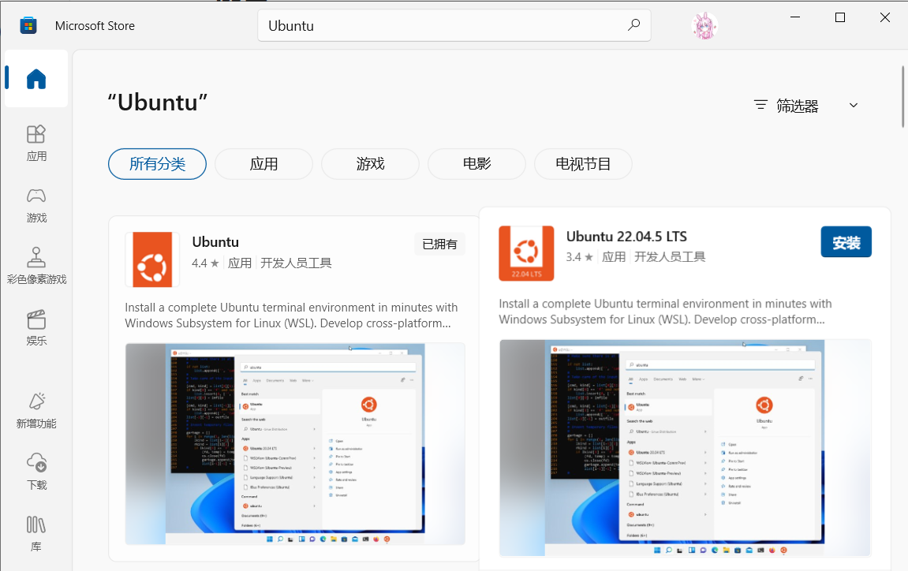
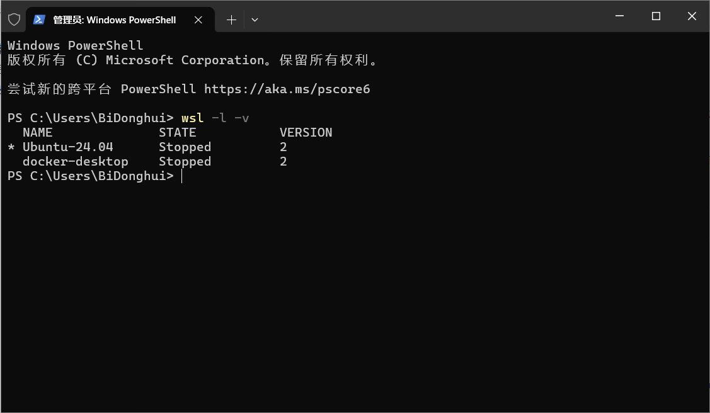
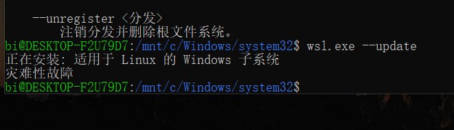
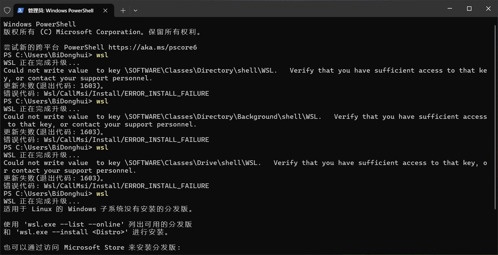

# WSL安装教程与使用方法（GUI与终端安装）

## 前言

<span style="color:red">**注意，本教程会过时！！！**</span>**请永远以官方文档 [安装 WSL | Microsoft Learn](https://learn.microsoft.com/zh-cn/windows/wsl/install) 为准。**~~如果你要当时间警察当我没说。~~

昨天与琉璃一起安装的时候盲目按照自己2021年初的方法配置，~~自己硬造出来了一大堆bug，~~现在看了官方文档以后发现很多地方都不一样了，特别是当年WSL1刚刚出的时候，配置极其繁琐与麻烦，现在的配置步骤相较于以前已经精简了许多。

这里推荐一下Windows应用商店里面全新构建的终端[Windows Terminal|微软应用商店 ](https://apps.microsoft.com/detail/9n0dx20hk701?launch=true&mode=full&hl=zh-cn&gl=cn&ocid=bingwebsearch)，长得颜值还可以，字体也比较好看，各种颜色都比较丰富，可以一试。~~（本人极其颜控，软件长得丑会极大地衰减学习兴趣）~~

## GUI版安装教程（强烈推荐）

### 常规安装步骤

1. 首先请确保你的Windows版本大于Windows10 2004。

   查看方法：按下Win+R，输入`winver`，弹出的对话框中即可显示当前的系统版本。

2. 直接在Microsoft Store中搜索Ubuntu 24.04LTS或者你想要的版本（Debian，ArchLinux等）如下图，点击安装。

   

2. 微软应用商店会帮你处理所有事情，理论上来讲经历两次重启以后（第一次在点下安装的1分钟左右，第二次在安装完成之前），就可以用了。

3. 按下Win+S，输入`Powershell`或`cmd`或者你自己安装的终端。输入

   ```shell
   wsl -l -v
   ```

   应当显示如下内容：

   

5. 安装完毕

### 问题解决

1. 目前大部分WSL应用均要求WSL2，如果你在应用商店安装过后发现上述步骤三中的截图中Version显示为1，则应当使用以下命令将WSL版本切换为2

   ```shell
   wsl --set-version Ubuntu-24.04 2
   ```

   请将上文中的 `Ubuntu-24.04` 更改为自己想切换的发行版

   想知道WSL1和WSL2的区别以及什么时候需要使用WSL1，请参考官方文档：[比较 WSL 版本 | Microsoft Learn](https://learn.microsoft.com/zh-cn/windows/wsl/compare-versions?source=recommendations)

2. 如果你想安装的版本应用商店里面没有，或者是你没有微软应用商店，请参考下文终端自动安装方式。

3. 在微软应用商店安装Ubuntu20.04LTS时，可能在执行 `wsl --update` 的时候报错，内容如下：

   

   再次执行 `wsl --install` 和其他的所有wsl操作时，会出现以下界面，报错1603，并永远卡死在这里：

   

   经查询全网都没有解决方法，也没有人提出相关问题。自己以前倒是遇到过此类情况，原因为安装软件时软件错误地配置了注册表键值权限，导致它自己无法配置。我在新电脑上重新安装了WSL，并没有发现这些键值，因此个人认为直接删除这几个目录即可，如有疑虑请自行考虑解决方法。

   以管理员身份运行终端，输入：

   ```shell
   reg delete HKEY_LOCAL_MACHINE\SOFTWARE\Classes\Drive\shell\WSL /f
   reg delete HKEY_LOCAL_MACHINE\SOFTWARE\Classes\Directory\background\shell\WSL /f
   reg delete HKEY_LOCAL_MACHINE\SOFTWARE\Classes\Directory\shell\WSL /f
   
   ```

   执行完毕后问题解决。

   


