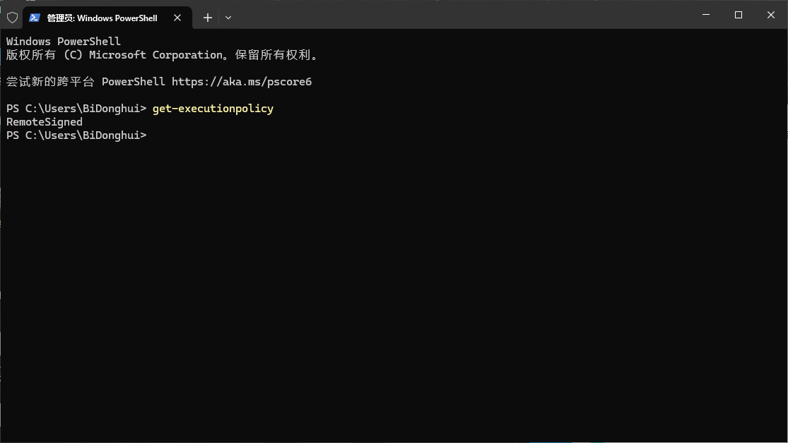

# Windows下使用powershell的时候显示此系统上禁止运行脚本

## 问题

由于Windows的安全策略，在运行一些脚本的时候，会提示“此系统上禁止运行脚本”。这是由于默认Windows的执行策略是“Restrict”，改为“RemoteSigned”即可

## 解决方法

以管理员身份打开终端或者powershell（cmd不行），然后输入

```shell
set-executionpolicy remotesigned
```

然后关闭powershell，再次以管理员身份打开，输入

```
get-executionpolicy
```

显示如下，问题消失


