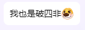
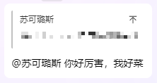

# 保研流程指南

## 前言

写这篇文章的目的一是为了回忆自己人生中的一小段重要经历，更重要的是因为自己想要记录一下这次宝贵的经历，避免后人重复踩坑。

在保研过程中就发现EE这边的信息代际传承做的和隔壁CS差的不是一星半点。电信保研的很多信息都是靠师哥师姐们口耳相传得到的，有可能是电信不太喜欢使用GitHub或者CSDN写文章的缘故罢。也希望电信的大家保研之后可以多多传授经验，这样知识才能代代传承下去。

**保研政策风云变幻，年年都不大一样。**本文写于2024年10月，完结于11月，其内容仅仅与吉林大学电子科学与工程学院电子信息工程2024年保研形势完全符合，仅供参考，一切以你们保研当年的最新政策为准。**若盲目按照本文操作，导致保研出现差错，后果自负。**

## 保研前你需要做什么

**此处的“保研前”指的是夏令营开始前的几个月里需要做什么，如果想了解大一大二大三需要做什么，请转至《保研er们从大一开始就需要做的准备工作》（还没写而且不是很想写）**

### 了解保研流程

自2020年以来，常规保研总体分为三步走：夏令营，预推免，九推。下面将逐个介绍。

#### 夏令营

夏令营一般会在每年的5月-7月举行。2024年的CS的主要夏令营在Github上面有罗列：[CSSummerCamp2024/README.md at main · CS-BAOYAN/CSSummerCamp2024](https://github.com/CS-BAOYAN/CSSummerCamp2024/blob/main/README.md)，大家可以访问这个Github仓库查阅2024年的夏令营通知。2025年不出意外这个会继续维护，请大家直接搜索CSSummerCamp2025来查询。

夏令营的主要的目的是掐尖，而且是掐品质最高的尖。当然不同学校对学生的吸引力有所不同，通过夏令营能从同等水平的高校甚至更高一档的高校中抢夺到优质生源，对于学校来说已经是成功了，办夏令营的钱就没白花。由于夏令营是第一批保研竞争，不出意外难度较大，很多同学都会被卡在入营的环节。好在夏令营战线较长，大家可以同时报名一大堆 ~~当海王~~，但是要权衡好报名与参与，因为盖章，写推荐信准备文书都是比较劳神伤财的事情，甚至有些学校要求必须邮寄纸质版（下面再详细说明），还有些学校（比如我们）6月第一批夏令营开始的时候还没有开始期末考试，因此不宜报名过多夏令营。

夏令营有线上有线下，线下营有些会报销吃住，这种审核就会很严格，毕竟学校花了真金白银请你过来。高水平报低院校来炸鱼的和水平不够的都会被筛掉。有些营不报销吃住，审核就会稍微宽松一些。线上营，除少数几个如北理MEMS（因为刚成立，没钱），一般都是大海营，因为没什么成本，所以学校可以把精力全都放在面试上。但是这种竞争也会很激烈，因为不会筛掉炸鱼的，所以有可能会有能力超级强的人来和你一起竞争。

夏令营的举办形式也很多样：吉林大学、中国科学技术大学的夏令营，充满人文关怀，群里氛围也很好，老师也很温柔。带你逛校园吃校园，中科大据说还有才艺汇演。哈尔滨工业大学似乎就少了那么些人文关怀，基本会以面试为主。上海交通大学据说会有笔试和面试，要先过笔试才能进入面试，考察比较严格。而线上营一般就是宣讲+带领参观+面试。

夏令营通过面试的同学会被称为“**优秀营员**”，不同学校的优秀营员效力不尽相同，大家可以上小红书上查询自己的优秀营员是否为“铁Offer”（查询时务必精准到学院和方向，且尽量查询离自己时间比较近的）。有些学校优秀营员无效（西交微电子2024线上大海营），有些学校优秀营员以后还要进行二次选拔，有些学校超发offer（哈工大2024SEIE养鱼），有些学校会鸽offer（据说天大），有些学校是铁Offer（吉大电院，北大软微，复旦电信，复旦微电）。拿到铁Offer以后可能会与你签一个协议，告诉你在九月份取得本科保研名额后可被该院校直接录取。或者即使你还得再来一趟学校参加复试，签了这个协议就能让你在笔面试成绩相近时被优先考虑。**自此，夏令营结束**

夏令营的形式多样，时间较松，机会很多，考核形式也不尽相同。很多保研er都是在夏令营的时候拿到offer的。因此建议大家不要因为夏令营竞争压力大而把赌注全都压在后面。

**注意：无论是什么形式，考核都是夏令营中最重要的一环。有些学校如2024年西安交通大学微电子学院不组织面试，其夏令营就毫无意义，可以不报名。**

#### 预推免

一般从8月开始，学校会组织预推免。因为有些学生放了学校鸽子，导致学校没有录满，还有空缺，就会以此来进行二次选拔。很多大佬都在夏令营的时候拿到了铁Offer，因此预推免的时候大概率就不用和他们竞争了~~（但是有些大佬酷爱集邮，自己反正闲着没事儿做就去卷剩下的鼠鼠们，以此为乐，极不推荐）~~ ，难度就会减小不少。

**注意：并不是每个学校每个学院都会举行预推免，比如清北的诸多院系，当少数几个放鸽子了以后会用本校的学生予以填充，而不会举办预推免。而东南大学信院的夏令营是在8月23号举行的，已经成为了事实上的预推免，故不再另行举办。**

预推免基本都是线下，而且时间比较紧凑。除少数几个预推免夏令营合办的学校，大多数时间都在8月20日到8月31日，9月10日到9月20日。因此大家报名要慎重，不宜同时报名过多。

预推免的举办形式较为单一，基本就是过去就面试，面完就走人。但即使是这样，10天的时间也仅仅够大家飞5个地方，价钱很贵很贵，且还不谈有些学校时间撞了，有些学校面试前一天才会告诉你你是在哪一天，上午还是下午面试。因此要慎重选择时间。

预推免的优营一般效力较高，因为一般是学校没有招满才会举办预推免，而且来的学生基本都已经确认自己可以获得保研名额了，一般都比较有诚心。但也不排除有些学校是为了给自己留好退路找了一大堆候补。

#### 九推

以上所有的“优秀营员”“预推免优秀营员”“协议”都是学校自己定的，他们如果想给你鸽了也是可以的。唯有到了九推这一步，学校一旦确定招你，同时你点了通知，学校就再也无法将你鸽掉，这个九推是国家的正式系统，和高考填报志愿是一样的。

九推是在9月28号填报系统的时候开始计算，到10月中旬左右系统截止。9月22号大家开始完善信息，9月28号大家开始填报自己的志愿，9月29号各个学校开始录取。分为两种情况：

1. 你已经在这个学校的夏令营/预推免中获取到优秀营员，那么九推大概率就是走个流程，你在报名以后，学校会在9月29号9:00开始给大家陆续发送复试通知,网站如同高考查分网站的时候一样，非常卡，你需要在短时间内点击确认复试通知（通常是15分钟左右~~，有些学校比较抽象，2分钟急速确认，他们自己都卡的发不出去通知~~）。随后学校会给你发送拟录取通知，同样需要在短时间内点击同意。**自此，保研结束！**
2. 你夏令营预推免全军覆没，没有Offer。只能在这个时候报名自己喜欢的院校。那么你需要先报名，然后等待报考院校向你发送复试通知。发送完复试通知以后点击确认。随后你需要去参加复试，复试通过以后学校会给你发送拟录取通知或者给你退回。等到你点击确认拟录取的那一刻。**保研结束！**

九推是保研的最后一关，从这个流程大家似乎可以看出来，九推蕴含了保研的全部流程：报考，投递材料，面试，拟录取；而且是全套流程且不会放鸽子。因为一开始的保研就是靠九推这一步的。后来他们为了抢夺生源，才在九推前面加上了预报名，后来为了进一步抢夺生源，才又加了夏令营。

到了九推这一步，由于其唯一性（每个同学只能报名三个志愿，确认三份复试通知，最终只能接受一份拟录取通知。），确定性（国家官方系统，只要确认就不可能放鸽子），导致大家无法继续做海王。此前手握一大堆Offer的海王在928也需要释放掉剩余的Offer，因此九推上岸好学校的机会是最大的。因此坊间有流传：

**待到来年928，鸽子鸽完鼠鼠杀。**

**冲天鸽子飞出笼，满城都有Offer拿**

但是928时间很短，且好学校的好专业如果没有人放鸽子，即使你可以填报，他们也不会发送复试通知。而且如果你手中有Offer，但并不是很好，那么鉴于上文中第一条说的，你需要在15分钟内确认你的保底Offer，而你心目中更好学校的Offer可能需要参加复试以后才能够拿到。你就不得不放弃保底去搏。一旦失败，可能去的地方还不如你的保底Offer。风险极大，请自己权衡。

### 了解保研黑话

**这个是你必须要理解的内容，无论是保研群里面还是同学交流，大家都比较喜欢说这些词，你在保完研后也会习惯说这些词的**

1. **放鸽子**：[放鸽子_百度百科](https://baike.baidu.com/item/放鸽子/160995#:~:text=放鸽子) 

2. **Rank/rk：**排名，分为学业排名（带上所有选修，体育，军理和专业课的排名，但不算素质加分；**吉大2024年EE专业夏令营只给开这个排名证明**）；专业课排名（不带选修，体育，军理，素质加分的排名）；综合排名（专业课排名+素质加分；**吉大2024年EE专业预推免和正式推免只给开这个排名**）。

3. **offer/优营**：即优秀营员，有些学校优秀营员无效（西交微电子2024线上大海营），有些学校优秀营员以后还要进行二次选拔，有些学校超发offer（哈工大2024SEIE养鱼），有些学校会鸽offer（据说天大）。因此offer不代表拟录取。

4. **铁offer**：优秀营员即为拟录取通知。也就意味着得到了优营且不想继续冲刺就可以坐等9月28号填报系统了。**（北大软微、吉大电院等）**

5. **com**：committee，委员会。可以简单理解成学校的招办。具体强弱com可以在这个网站中查到 [院校COM概念 - CS-BAOYAN-2024](https://cs-baoyan.github.io/CS-BAOYAN-2024/院校解析/)。

6. **强com**：强com的学校招办说了算（招办更强），也就意味着你必须先通过他们的面试，才有可能被录取。**一般强com的学校无需提前联系老师，但是也有例外。你的主要目标应该是复习专业课知识，通过面试。**

   据反映强 com的学校更加看重出身，即 985/211的学生更容易被强 com学校录取。其次通过面试以后少部分学校会组织导师双选，有些是开学以后双选。大部分都需要自己另行联系老师。有些学校即使面试通过。

7. **弱com**：弱com的学校导师说了算（招办更弱），也就意味着你必须提前联系老师，老师同意后才有可能被录取。

   大部分弱com的学校面试都是走流程，实际上老师已经提前和招办打好招呼，传了名单，面试只是看你有没有什么特别重大的问题。

8. **title**：学校名头：一般CS/SE/EE学科都是按照：**t2**（清北），**华五**（复交浙南中科大），**C9**（清北华五+西交哈工），**中九次九末九**这样分类。还有**两电一邮**等title不一一举例。

9. **bg**：background，背景。一般指你简历里面的排名、科研、竞赛、论文、英语水平等。

10. **三无**：无竞赛无科研无论文。（我就是）

11. **纯rk战士**：rk超级高的三无选手。

12. **bar**：入营/优营门槛，即你的bg（背景）达到什么门槛才能够入营。大部分强com学校都比较看重你的bg，会卡本科的段位。

13. **92**：本科是985/211。

14. **双非**：非985/211。

15. **四非**：非985/211，且非双一流。（非常不提倡大家使用诸如四非，乃至六非九非等乱七八糟的词汇来在群里卖弱，没有意义）

    

    

16. **wl**：waiting list：候补。有些学校会留一些候补名额防止学校被学生放鸽子。不同学校的候补优先级不一样，大部分都是优营>夏令营候补>预推免优营>预推免候补>九推。但也有一些学校就不点名了，会把不知道哪里来的好学生插在你前面，导致本来是候补第一，结果没参加预推免直接被挤到候补第三第四。

17. **释放offer**：指自己有了更好的去处，从而给老师或者学校招办说自己不去了，这样名额就可以依次顺延。建议大家有更好的去处一定要提前释放offer。

18. **鸽子**：约定好/签协议后单方面放鸽子的人。可以是学生鸽学校老师，也可能是老师鸽学生。（在2021年左右的时候鸽子特指临近9月28号才释放offer的人）

19. **oq**：over qualified：太NB了以至于学校把你筛掉了，有些学校，特别是华五以下会筛oq，可能会发生我夏令营这样华五没人要，中九全给我oq了的情景。

20. **学硕**：传统意义上的硕士，3年学制，做科研发论文毕业。有宿舍，学费较低，申请难度较高。

21. **专硕**：更偏向专业性质的硕士，一般条件会比学硕差点，毕业条件也较学硕稍差，学费较高，大城市的某些大学（复旦、上交、北大）甚至不提供住宿，读这个的成本激增。但是因为条件稍差，所以竞争小很多。

22. **硕博连读**：无需经历答辩即可直接转博士，毕业获得博士硕士双文凭。

23. **直博**：直接跳过硕士攻读博士，一般条件较为辛苦毕业后颁发博士文凭。且若最终无法毕业，也没有硕士文凭。因此竞争较直硕小。

24. **夏0营**：夏令营一个Offer都没得到，若在9月20号左右即为准备冲刺九推。~~（但群里经常有卖弱的，明明手握一堆Offer总是说自己夏0营）~~

25. **捡漏**：929后因为其他学校/老师被鸽结果获得了很好的Offer。

26. **蓝裙/绿裙**：电信保研交流群/计算机保研交流群。

27. **保研春晚**：指929凌晨。

28. **套磁**：给老师发邮件，以获得进组机会。

29. **牛导/羊导**：名气非常大的导师/放养的导师

30. **鸽穿**：指学校被学生放鸽子以至于替补到最后一名还不够，只能开放九推继续招生。

### 保研预备材料

**强烈建议准备完这些材料后自行整理好文件夹不要乱丢，否则准备材料的意义将不复存在**

#### 简历

一份好的简历应当兼具美感与内容。具体保研简历制作已经有很多模板可以参考了，我在这里就不过多赘述了。简言之就是个人信息要全面，成绩，本科院校，政治面貌（可选）。写的时候扬长避短，春秋笔法。

但是需要注意的一点是：**众口难调，有些老师更喜欢你的项目经历更多一些，有些老师则觉得那都是虚的，都是拿往届的东西水出来的，他更想看到你的成绩优异，四六级分数高，奖学金得的多。因此如果你能提前摸清楚对方的胃口，可以准备多个简历。**

另外简历最好附带自己的未来规划，比如自己要不要读博士一类，这个尽量针对目标定制。自我介绍的时候尽量体现自己乐观的生活态度。

#### 证书&证件

尽量使用扫描全能王或者去打印店将自己的证书全都扫描下来存到电脑里面；身份证，学生证，证件照，四六级证书等都准备好，避免到时候需要的时候找不到。

#### 项目照片

自己参加竞赛或项目的时候的团队照片啊，或者实验过程中的照片。总之能够证明你参加过这个比赛或者科研的资料都可以准备一份，以后你做PPT~~给老师吹β~~的时候可以用得上。

#### 个人简介

这个网上也有很多教程，请自行搜索~~（我懒不想粘贴网址了）~~。需要注意的是：**和简历不同，个人简介需要注意行文方式，不能简单的堆砌自己的成果。可以参照：前言（可以以后再写，因为需要针对不同学校写），学习情况，竞赛情况，综合素质（班委，社团等），未来规划（是否要读博）**

### 决定方向，进一步收集材料

随后，你需要决定自己去往什么方向。并关注相关院系和夏令营。举例我们电子信息工程可以做很多方向：通信，自控，电路，芯片，转码等。具体可以在这个网站上查到： [0809 电子科学与技术-全国第四轮学科评估结果公布](https://www.cdgdc.edu.cn/dslxkpgjggb/xkpm/gx/a0809_dzkxyjs.htm) 每个学校的学科评估也会在这个列表上出现。

注意：**本表为第四轮学科评估的结果，有些学校会“宣称”自己某某学科为A但是表中显示为B+等，因为他们使用的是最新的第五轮学科评估。第五轮学科评估因为各种各样的原因没能公布（可能到你们的时候就公布了也说不定），所以我还是参考的第四轮的官方文件。**

## 保研开始（自此开始都是个人经历，请酌情阅读，批判性吸收）

### 夏令营前（4月1号-6月20号）

看到这里，如果你前面跟着我的教程走了一遍并在劳动节前后把所有资料全部集齐并整理好，你已经领先了大多数保研er了。但是仍然不能够松懈，因为现在要开始报名夏令营了。

#### 弱com学校套磁老师（4月1日-5月9日）

因为我只报名了一所弱com学校，因此只套过2个导师，均为4月上旬联系。两位老师不愧是来自同一学校，极为抽象。下面会有抽象行为大赏。这里先分享一下套磁邮件应该怎么写。

##### **套磁邮件写法**：

1. 邮箱要选好，不要使用QQ邮箱，例如123456789@qq.com的邮箱会导致导师把你的邮件忽略掉（导师邮箱也是QQ邮箱的时候除外）。尽量使用**学校官方edu邮箱**（也有坑，比如吉大的学生邮箱默认把所有不是@mails.jlu.edu.cn的邮件扔进垃圾桶（可以调）；据说复旦会把上交的邮件扔进垃圾桶，上交也会把复旦的邮件扔进垃圾桶），或者另外注册一个**163邮箱**使用（推荐，还有会员可以看对方是否阅读了自己的邮件）。

2. 要好好撰写主题，其格式最好是：吉林大学-姓名-专业-研究生申请（名额咨询）

3. 内容不要过于冗长，有些同学把自己的个人简介1000多个字洋洋洒洒全都写上面了，老师根本不想阅读。简明扼要寒暄以后按序号罗列自己的技能，把简历里面契合老师研究的方向列出来，表现自己的能力即可

4. 排版美观，分门别类，适当使用粗体

5. 言语应使用敬体，但是注意！！！**请勿过度使用敬辞，例如“拨冗”、“滥觞”、“斧正”等过于矫揉造作的敬语应避免使用，有些理工科老师很反感，认为是在拽词！！而且 ~~看不懂~~ 难以阅读 ！！**

6. 自己的简历等可以随附在附件，这样老师如果对你感兴趣可以更详细地了解你。

7. 结尾可以表现自己的诚恳态度，顺便附带上自己的手机号（微信号），这样老师可能直接会恰V，成功率大大增加。

8. 落款不必使用此致敬礼，这不是书信，请查阅[如何撰写一封优秀、高效得体的邮件来提升工作效率呢？ - 知乎](https://zhuanlan.zhihu.com/p/435962281) 

   并且此致敬礼太正式，不如顺祝春祥/夏祺/秋绥/冬安（个人看法）。

9. 注意发送时间，不要趁老师睡觉或者不在工作时间的时候发，因为很有可能老师早上醒来会点开邮件看一眼，然后想着到学校再回你，结果到了学校就忘记了。也不要趁节假日发，有可能老师的邮箱并不会推送到手机上，等到7天假期过了以后你的邮件就会淹没在一堆垃圾邮件中间。

10. **不要群发！！！不要群发！！！不要群发！！！**先不论有些同学群发的时候称呼不改或者使用抄送功能导致老师们都能看到，同一个组里，甚至同一个学院的老师都会有相互交流，如果任意两个老师互相串通了信息发现你在海，那后果基本上就是两人都不接收你。所以同一时间不要群发一大堆老师。

##### **老师已读不回怎么办**

可以再次发一封更简短的邮件，礼貌地询问组里是否还有名额。如果还不回，就直接下一个吧。

##### **套到老师以后**

~~我也不知道该怎么办，因为我没套到。~~

##### 迷惑行为大赏

下面的三段对话发生在我套磁某两电一邮弱com院校的时候。行为极其迷惑，致使该校直接从我的梦校一落千丈跌出备选名单。

> **第一个：**
>
> 4月5日（第一封邮件）
> ——吉林大学XXX-研究生申请
> ——已读不回
> 4月12日（第二封邮件）
> ——吉林大学XXX-研究生名额咨询
> ——已读不回
> 4月30日（第三封邮件）
> ——吉林大学XXX-假期快乐以及因打扰表示歉意
> ——已读不回
> 9月25日（老师回复了我的邮件）
> ——re：吉林大学XXX-研究生名额咨询：欢迎报考我课题组
> 我课题组对学生有如下要求：（科研水平、抗压能力等）
> 
> **笑点解析：弱com院校4月联系你你不理我，到了保研春晚前夕估计是被鸽穿了，才来找我。而且临近9月28日的这封邮件语气态度极其强硬，处处透露出一副看不起北方大学的语气（似乎是该校校风），而且受到下面两位老师的荼毒，导致我对该校的印象在接到最后一封邮件时早已跌至谷底，因此我选择了——已读不回。**

> **第二个：**
>
> 4月17日（第一封邮件）
> ——吉林大学XXX-研究生申请
> ——已读不回
> 4月29日（第二封邮件）
> ——吉林大学XXX-课题组名额咨询
> ——回复：同学你好，之前看到了你的邮件，节前我还在忙上一届统考生的相关工作。现在联系为时尚早，如果同学有意向的话咱们节后联系！祝好！
> ——回复：好的老师，谢谢您百忙之中抽时间回复。
> 5月8日（第三封邮件）
> ——吉林大学XXX-研究生申请
> ——回复：你好同学，我课题组现在已经招满，谢谢关注。
> ——回复：老师您不是说让我节后联系您吗，怎么就一瞬间招满了？！
> ——回复：如果你认为5月8日才算节后的话，我认为你不具备进我组的基本素质。
> 
> **笑点解析：4月29号告诉我太早了，要我节后联系。正常五一放7天，我害怕打扰你休息坏你好心情，8号等假期过了才给你发邮件，结果回复我一个“我不具备进你组的基本素质”。让我猜你心情的谜语人是吧。**
>
> **其实这个就因人而异了，我们学校和我关系好的的老师是非常不喜欢正放着假你给他来个工作邮件的。**

> **第三个**：
>
> 5月7号（第一封邮件）
> ——吉林大学XXX-研究生申请
> ——已读不回
> 5月9号（正在吃饭，一个电话就突然打过来了）
> ——你好，你是XXX是吧，我是XXXX大学的XXX，现在给你打个电话是想聊一聊详细情况
> ——好的老师
> ——你们大学在你那块是算985是吧。（这句话极其不明所以，不知道问这个是做什么的）
> ——是的老师
> ——那你说说你有什么科研经历吧，大创不算啊，你们北方大学那种大创都怎么来的心里应该都知道，自己做了没有自己心里清楚
> ——（不爽，但还是很礼貌）没事老师，反正我也没有大创。
> ——那你发过论文啥没，要自己做过的
> ——没，老师我主要是竞赛参加得多，项目做得多。
> ——行啊你说说你都参加过什么。
> ——（blabla说了一堆）
> ——不错啊你这个，都是自己做的吗？这都是很珍贵的经历啊！综测加了不少分吧。
> ——对，基本都是我自己做的，但是都没得国奖，没加分。
> ——那你吹啥呢，还基本都是自己做的，自己贡献不超过10%
> ——（开始有点生气了，但是不敢得罪他）老师我这儿都有全部的资料，随便抽查一个点我都可以给你说出来。
> ——我不听你那资料，你们北方大学一个东西传几代，你在这上面的贡献不超过10%，资料都是背的，能理解的有几个啊
> ——（开始摆烂）那行吧
> ——你那项目呢，我听听有几个是真的
> **风力摆：这不是往年电赛作品吗，复刻也算？**
> **8位单周期指令CPU：这不是我们学校FPGA实验内容吗？**
> **墨水屏智能电子终端：这不是我们学校物联网课设吗？**
> ……
> ——得了你做这些都没啥技术含量，你直接说说你会点啥吧
> ——老师我会画低频PCB，VHDL，Verilog也会点，单片机会用ESP32和Arduino，51，其他的也在学。各种工具也会用，像是Mathematica，MATLAB，AutoCAD，Simulink，各种Linux系统也比较熟练（被打断）
> ——我已经在这儿听你扯13分钟了，一点我想听到的东西都没有，你这些别的学生不会做吗？你能不能拿出一些**有实际价值、不是课设实验、别的学生不会的真才实学**出来？
> ——（彻底摆烂）老师我会日语俄语拉丁语和德语
> （他把我电话直接挂了）
> 
> **笑点解析：不想要就直接说不想要，何必从头到尾挂着你那个“北方大学”不放。说我自己做的项目你又不信，说水一点的项目又说是课设实验。会东西还不能会其他学生会的，会点其他学生会的你又直接给我挂了。全程笑点，无需解析。**

#### 强com学校投递报名表

相比弱com，强com的学校流程就规范多了，不容易遇到上面的drama事儿。

不同学校要的材料都差不多，无外乎以下几类，但是提交材料非常麻烦，特别吉大又非常大，跑一趟挺费劲的。

- 系统填报：照着要求直接填就行
- 报名表：一般从官网上可以下载到，字写的不好看可以先用word编辑以后留下来需要手写的地方，然后再用手签字即可。一般报名表上需要以下材料：**学院公章、学院负责人签章，个人签名、成绩证明公章**
- 佐证材料：一般是电子版带有公章的**成绩单**，学院开的**排名证明**扫描件，**四六级证书，比赛证书**。（上文中已让你提前准备好）
- 简历：上文中已经让你提前准备好。
- 个人陈述：上文中已让你提前准备好。
- 推荐信：一般是自己写，然后拿去给老师过目签字，尽量打印出来，直接让老师签字即可，老师大概率不想写很多字。写的时候注意口吻，而且不宜写太长。（北大还要求密封骑扣签字）
- 有些学校还要求邮寄纸质版材料，请尽量邮寄原件并考虑到快递可能会延误一天等可能性。

投递完以后就可以坐等消息了。

**上面的步骤劳民伤财，但是不要怕，可以海投，只要别太耽误自己期末考试。个人觉得你可以海投，因为学校都会确认你到底来不来，但是如果时间撞了或者不想去，请及时取消，不要占着茅坑不拉屎就行**

### 夏令营（6月20号-8月23号）

接上文所说，我一开始是没想海投的，只投了C9（除了清北）和我吉，结果在6月20号左右，我陆续都接到了自己被拒的通知，最后只剩下了我吉、西交、哈工本（填错了，本来报的哈工深，材料全提交到哈工深了，系统一不小心填到本部了，即使这样它还是录我了）。在华五被拒的剩俩的时候我就慌了，于是抢救性补报一堆中九（后来也被拒麻了），在和西交师哥聊天的时候他告诉我可以试试北大软微，于是我也报了，没想到过了。最后通过的有吉大电院，北理集成，西交微电子，哈工信通，华东师范微电子。

#### **西安交通大学微电子学院**

好像是6月22号的线上营，报名的时候界面其实有写，本次夏令营不举行面试，不评选优秀营员。其实就是宣讲+弱com。声称参加夏令营会增大预推免录取概率，但是实际下来也没人点名和查到，所以基本没用，建议无需报名。

#### **华东师范大学集成电路**

7月1日到7月3日。集成电路专业似乎有一个强导，但是由于学校title比较奇怪，再加上通知过晚（6月29号），因此提前放弃参加。

#### **吉林大学电子科学与工程学院**

7月1日到7月3日。由于是本校，想拿个保底，就参加了。（其实后来发现不参加也行）吉大的夏令营人文关怀不错，包吃包住（有幸在湖畔食堂二楼撒开了吃，起码炫了日常50块钱的排骨），结营以后还有优营证书和伴手礼。

我校的面试我没想到会先绊我一下。因为我的头发比较长，又穿着女款JK衬衫，被老师说不男不女。以前的某任课老师一上来就灵魂拷问：**“你在咱们电院还挺有名的，我想问一下你去年选了我的XXXXXX课，上了一节又给退了，是因为不喜欢吗？”**一上来就被硬控了，整体表现都不大好。

整体来讲吉林大学电院的英语面试主要看流利度，没有自我发挥的问题，背就可以了。问题也主要以书本内容为主，后面问项目也都问的非常浅，据说比较看重成绩和出身。

#### 北京理工大学MEMS

7月2日，线上营，因此就选择了线上线下频分复用（雾）。7月2日我上午面试，由于姓氏的问题，我排名很靠前。北理的面试需要准备PPT。

整体面试过程非常流畅，可能是控场控到了，我自己感觉就是在聊天，但是下午的那个同学似乎反映比较难，也没有这么轻松。

英语面试主要看流利度，自我介绍就差不多，没有自我发挥的问题。问题主要围绕你的自我介绍展开，没有问专业知识，氛围十分轻松（可能是因为刚刚成立），项目问的比较深，肚子里得有点油水。

夹带个私货，北京理工大学MEMS周文彪老师人非常和蔼，感觉非常好相处，大家有对MEMS感兴趣的可以联系这位老师。

#### 哈尔滨工业大学（本部）

7月6日，因为报错了，而且不想继续留在东北，故提前放弃了。管住宿，但是缺乏人文关怀，态度十分强硬。面试是群面。

#### 北京大学软件与微电子学院

7月6日，当时因为和北京理工大学周文彪老师商量好要去北京见一面，于是决定顺便面试一下北大。当时我身边一堆rk1rk2进软微，就我一个电工rk7还三无，不知道为什么能进。反正从头到尾我都是抱着顺便去面试一下，去圣软微集个邮的想法参加的夏令营。因此直到面试前一天我还在看特朗普和拜登辩论，为我在软微的极佳反应能力和英语流利度做出了重大贡献。面试就没想着进，到了面试场地发现周围一大堆rk1rk2，有的还有SCI，国一，我就感觉自己是来当分母的，于是表现极佳，无所畏惧，面试的时候把老师硬控了，被第一波发了优营。后来一直也没联系到导师，反正就这么水灵灵的进了……

软微的芯片方向面试主要分三步：自我介绍、专业课问答、抽题。自我介绍是汉语，介绍内容是报名时交的PPT。随后的专业课问答是全英，一直英语到你说不出来为止。但是半吊子英语也能打哈哈打过去，用尽Chinglish表达，再使劲比划，在黑板上画个驻波告诉老师 this kind of wave。最后老师实在没绷住在最后一个问题的时候让我切回中文说驻波。最后的抽题是半物、半材、模电数电三个信封里面抽一题，我从模电数电的信封里面抽到了一道高频+通信原理，推测里面还有信号与系统，数字信号处理等。

英语面试主要看自由发挥，背没有用。各种考察都很深入，考得很细致而且量身定做，根本无法准备。还会故意问一些你没学过的东西让你用现有的知识合理猜测一下，总体难度较高。

**参加完夏令营我就回家考驾照去了**

### 预推免（8月23号-9月25号）

#### 东南大学信息科学与工程学院

8月27日，东南大学这个到底算是夏令营还是预推免有待商榷。东南大学是典型的超强com，面试极其严格。电路与系统分三个屋子，第一个屋子英语，第二个屋子专业基础知识，第三个屋子专业扩展知识。

第一个屋子：并非全是英语，英语只有一分钟。之后会问你都会点什么，我不假思索模电数电，结果给自己挖了大坑，问的问题都答不上来，老师直接批评，压力很大。

第二个屋子：并非都是基础知识，会问你学过什么，我有了上一个屋子的教训说：“我会嵌入式和FPGA”，老师：“但我们不搞这个”，我：“那我会通信原理和信号与系统”，老师：“那你为什么不去报隔壁通信或者信号呢？”，我：“……”，老师：“这么着，我问你点模数电吧。“ 遂卒。

第三个屋子：并非都是扩展知识，会问你学过什么，我有了上上一个屋子的教训说：“老师，咱们专业需要点什么？”老师：“模集数集学过吗？” 我：“没。” 老师：“那我问你点模数电吧。” 遂卒。

出结果，候补第一。

### 九推（9月22号-9月29号）

九推系统的填报说明可以参考：[九推系统填报手册](https://cs-baoyan.github.io/CS-BAOYAN-2024/填报指南/九推系统填报手册.pdf)

9月22号，大家就可以登录研招网完善自己的信息了。这里需要注意，照片需要近期不戴眼镜的露眉毛露耳朵照片。我因为头发和刘海长，所以处理起来比较困难。建议大家提前准备好照片。

9月27号，临近保研春晚，有些学校例如东南大学，会在鸽子满天飞以前打电话询问你是否要填报，若放弃，则往下面顺位替补，大多数候补的孩子都是在这个时候接到通知的。但有一些鸽王此时仍然紧握一堆offer，欺上瞒下，可能会对来年的师弟师妹造成非常恶劣的影响，希望不要做这种精致的利己主义者。

9月28号，开始填报志愿，总共可以提交三个志愿，48小时后可以修改。个人建议如果有铁offer填一个即可，如果没有铁offer就要慎重，最好能留出一个槽位备用，因为有些学校不给退档，只能等48小时自动解锁。如果此时有了更好的offer你却没有槽位，那对不起，就没机会了。

9月29号上午9点，各个学校开始下发复试通知和拟录取通知，系统会很卡，大家需要在短时间内确认offer，如果卡了进不去一定要给招办打电话说明情况，否则可能会被顺位替代。等到点完接受拟录取的那一瞬间，一切尘埃落定，可以截图发朋友圈了。

## 保研结束

### 碎碎念

保研结束后发现大家都过上了不一样的生活：保研本校的早早开始进组给老师打工；直博的学生早早开始读起了论文，开起了组会；保研外校的有些已经找到导师开始被压榨，有些还没有导师在过Gap Year（我）。大家都有光明的未来喵♡

### 注意事项

1. 面试主打的是一个控场能力，老师把你硬控了那就是东南大学那样子，你把老师硬控了就是北京大学那样子。
2. 鸽子真的很可恶，特别是那种临近929才放鸽子的，可能会导致第二年你们学院被对方全拒。
3. 有心栽花花不开，无心插柳柳成荫。
4. 大多数的孩子们都是929填了自己保底的offer然后一瞬间点了确认，结果过了一小时发现华五给自己打电话问自己去不去，懊悔莫及。其实我觉得这个没必要。按照当时的心境来讲，再给你100次机会你也会点那个接受志愿的，绝不可能放弃保底去梭哈华五。因此顺遂天意就好。
5. **写这么多是因为自己踩过好多坑，不想让师弟师妹们把时间浪费在重复试错上。如果这篇文章有帮助，而且你的经济能力允许的情况下，可以点下面的赞赏奖励师姐一块小蛋糕喵♡**

