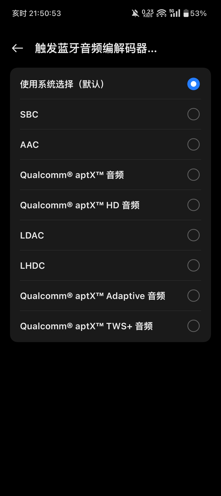
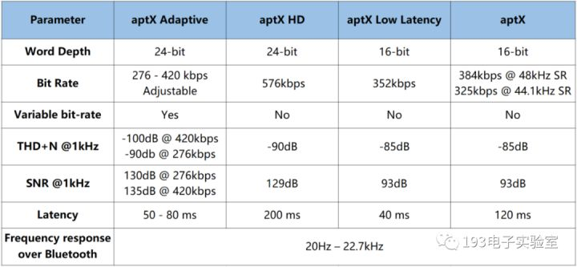
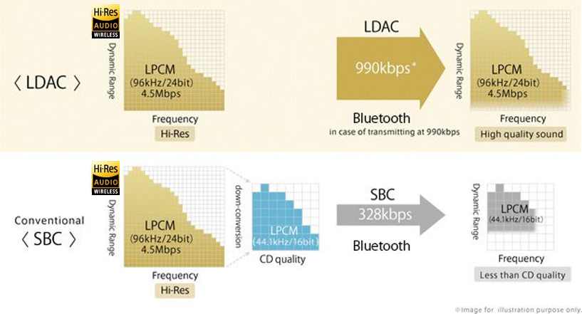

# 蓝牙音频编码以及传输模式

## 碎碎念

在选购蓝牙耳机的时候，经常看到蓝牙耳机有很多传输协议。自己以前也曾痴迷过HiFi，对一些蓝牙音频协议有所了解，也做了一些功课。现在在这里总结一下，小伙伴们选购耳机的时候也可以有所参考。

本文将从参数与主观体验方面评估各个编码的好坏。

## 蓝牙音频传输协议

目前从低到高的通用协议为SBC<AAC<aptX<LDAC≈LHDC，另外还有三星的SSC和苹果的Airport，这些基本都用过。

要查看手机是否支持一个编码，只需要打开 **设置-开发者选项-蓝牙音频解码器** 即可查看，如下图所示，我的手机（一加ACE3V）支持所有的通用协议。

### SBC

#### 参数

SBC，Sub-Band Coding，全称子带编码。SBC是所有编码中音质最差的一个，但是它的兼容性是最好的。原因在于SBC占用的带宽最小，而且Bluetooth在其A2DP (Advanced Audio Distribution Profile) 中规定：**SBC是必须支持的编码**

A2DP中规定SBC编码支持最大比特率是单声道320kbps，立体声512kbps。但按其推荐，实际上使用最多的是44.1KHz，328kbps的立体声传输。

SBC的优点是舍弃或减小人耳听觉不敏感的频率部分，在敏感频率处采用较细的量化，在低比特率条件下获得更好的听觉效果。

#### 实际听感

SBC协议可以明显听出高频的欠采样咔哒声以及低频缺失严重。再加上市面上只支持SBC的蓝牙耳机普遍都是PDD价值10元左右的耳机，解码芯片和发声单元的问题更为严重。因此听感较差，约为听个响级别

### AAC

#### 参数

AAC，Advanced Audio Coding，高级音频编码。AAC在蓝牙中常用的比特率是256Kbps。但是有一点，即使使用AAC音频源，蓝牙并不能直接传输其原数据流，而是先将AAC解码成PCM，然后再编码成蓝牙支持的AAC编码再传输。应用上，AAC编码最大的支持者是苹果，iPhone、iPad和 AirPods 等设备都支持AAC, **AAC协议是现在10-150元价位中大多数耳机支持的最高协议**

#### 实际听感

AAC协议是现在10-150元价位中大多数耳机支持的最高协议，说实话除了使用WH1000XM3和WI1000XM2，我在其他设备上感觉AAC与LDAC/LHDC没什么太大区别。AAC的音质日常听感完全够用，而且不会因为信道质量不佳而时常断连。个人认为是各个指标都比较均衡的一款编码。

### aptX

#### 参数

aptX（音频数据缩减技术）是上个世纪80年代设计的编解码器，用于电影院和广播中。编解码器后来被CSR收购，而CSR公司又于2015年8月被高通公司收购。

aptX目前分化成了三种：aptX低延迟，aptX HD，aptX自适应。

**aptX LL（低延迟）：**延迟接近30毫秒。SBC的延迟为170 ms。

**aptX HD（高清晰度）：**在24位和192 kHz时，最大比特率高达576 kbps。

**aptX Adaptive（自适应）：**旨在替代传统的aptX和aptX HD。能够改变比特率，它的最小比特率为276 Kbps，最大为420 kbps。但是，由于压缩方面的改进，可以达到与aptX HD 576 Kbps相同的质量。

#### 实际听感

由于我手头唯一一个支持aptX的设备单元极差（漫步者某TWS），故无法评价。单看参数，aptX HD达到了较高清晰度，理论上可以媲美LDAC。但不知是不是我手头设备的问题，感觉aptX HD集百家之短：既没有AAC的低延迟，又有LDAC的容易断联，而且自从索尼不再对LDAC收取授权费，大家都纷纷转向了LDAC和LHDC。

### LDAC

#### 参数

LDAC是索尼开发的一种音频编码，实现了以最高 **990Kbps** 的比特率通过蓝牙传输 24bit/96kHz 的高分辨率音频(Hi-Res Audio)。高传输码率使得高解析度的音频文件不会被过分压缩，保证了音质。

其实在上图中，索尼有点过分吹嘘LDAC的作用了。因为对于4.5Mbps的Hi-Res音频，要通过最高990Kbps的带宽传输，压缩率需要达到1:4.5，而目前最好的无损压缩率也只有1:2。所以说，**LDAC可以传输CD级音质，但是并不能无损传输Hi-Res音频，只能是接近**。

LDAC提升传输速率的原理是增加了蓝牙通信的信道，频带宽度提升了，但是这对蓝牙天线的要求也提高了。实际上，在信号较差，或者是受到干扰的时候，LDAC还会以660Kbps或330Kbps的比特率通信，保证连接性。**~~但是索尼自家的耳机优化的稀烂，会持续断联2-3秒后再卡顿一下才会切比特率~~**

#### 实际听感

本人木耳，但是仍然能听出LDAC编码器和AAC的区别。设备为WI1000XM2。LDAC在各方面都是顶级水准，除了在信号不好的时候经常卡顿断连之外，其他的都无可挑剔。

LDAC设备在使用过程中延迟非常高，自我感觉约有300-500ms，不适合打游戏。

另外WI1000XM2设备听感也不错，属于入耳式蓝牙耳机里面听着最舒服的一档了。

### LHDC

#### 参数

LHDC支持通过速度最高达**900kbps**的蓝牙连接传输 24bit/96kHz 的串流音频（也称高解析度音频）。与LDAC会先把原始音频进行升/降频到 24bit/96kHz不同，LHDC则可依照原始取样率输出，减少SRC过程的延迟。2019年9月，LHDC通过了JRS的Hi-Res Audio Wireless标准认证。

LHDC根据信号情况支持400/560/900 kbps的比特率。此外还有低延迟音频编解码器（LLAC）版本，也称为LHDC LL，端到端延迟约为30毫秒。

#### 实际听感

与LDAC相同，且连接更稳定。

同样的，LHDC的延迟也非常感人，不适合玩游戏。不过有LHDC LL模式，设备为漫步者·花再的头戴式耳机，实测延迟可以降低到与AAC相似的水平。

## 蓝牙耳机常用工作模式

### Low-Latency（低延迟）

此工作模式仅有一些支持LHDC LL，aptX LL的设备支持，在切换到低延迟模式（有些设备称之为“游戏模式”）后，会主动降低音质以换取更低的延迟。

### Stereo/A2DP（电脑上的标准模式）

此模式下使用SBC或AAC编码方式传输音频，但是只能单向传输，即只能从电脑到手机传输，因此无法使用蓝牙耳机自带麦克风。

### Hand-Free AG模式（通话模式）

此模式下使用56kbps的码率进行单声道音频传输，音质感人。Hand-Free AG是比A2DP更旧的编码方式，很多手机都不支持了。在连接上Windows10电脑的时候，可以看到音量菜单上面有Hand-Free AG的选项。

有些电脑APP在语音通话的时候，并不会直接切换到Hand-Free AG模式，此时蓝牙耳机和电脑都工作在Stereo模式下，使用电脑内置麦克风通话。此时需要点击任务栏中的音量，然后选择设备，手动切换到Hand-Free AG，才可以正常调用蓝牙耳机的麦克风通话。

