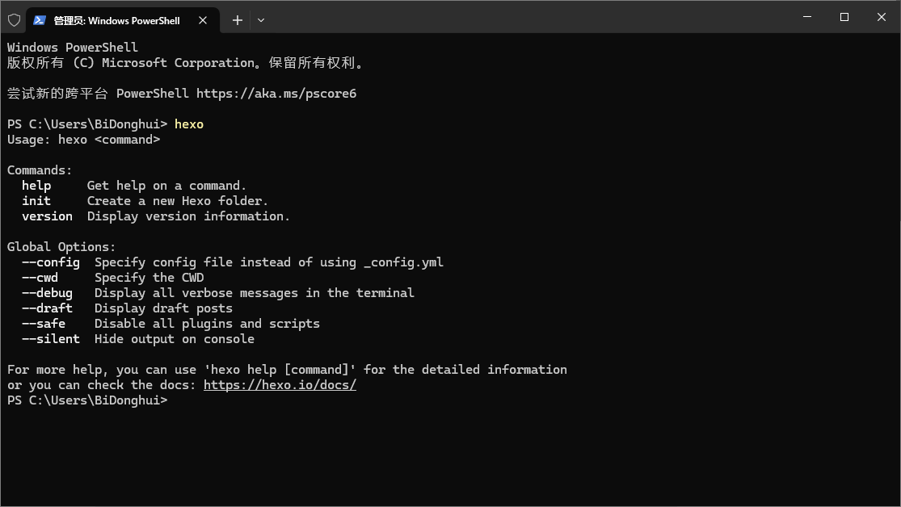
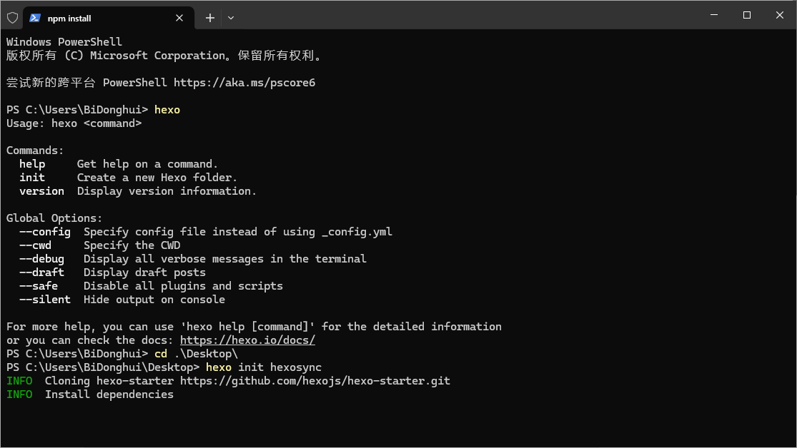
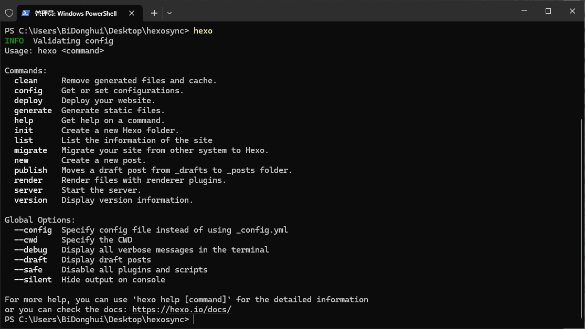
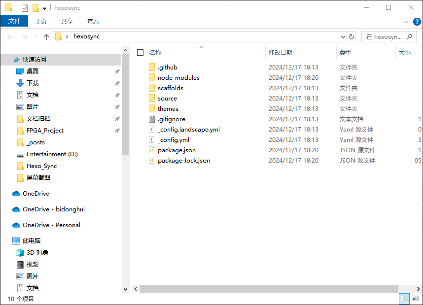
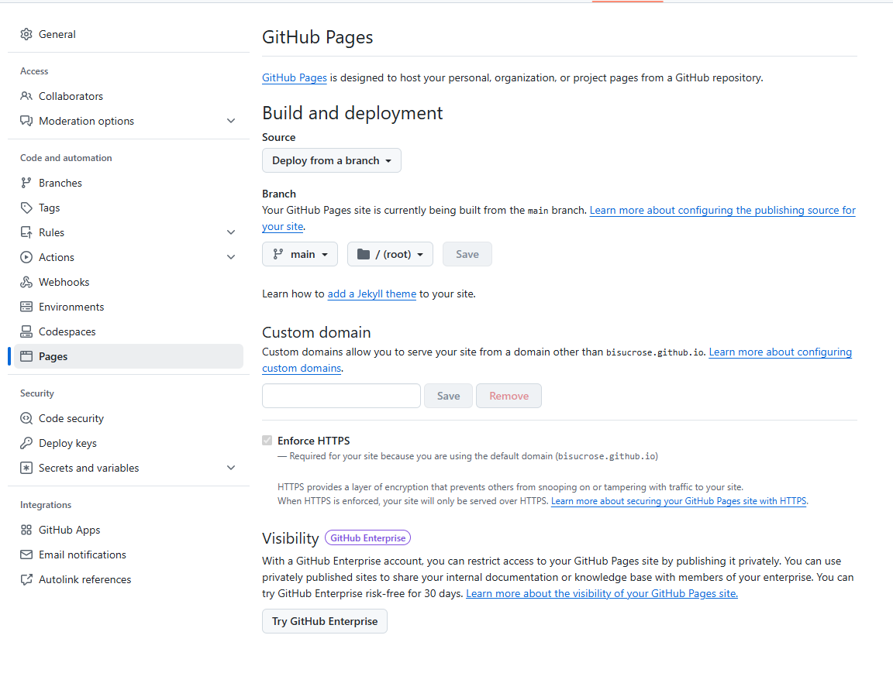
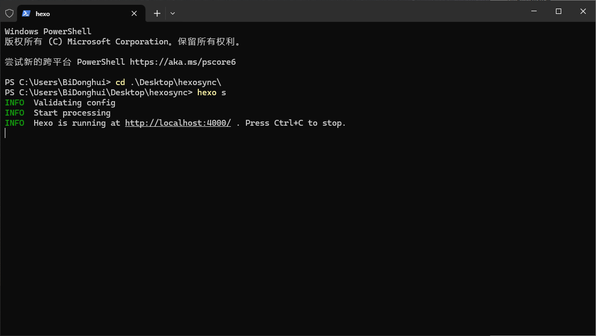
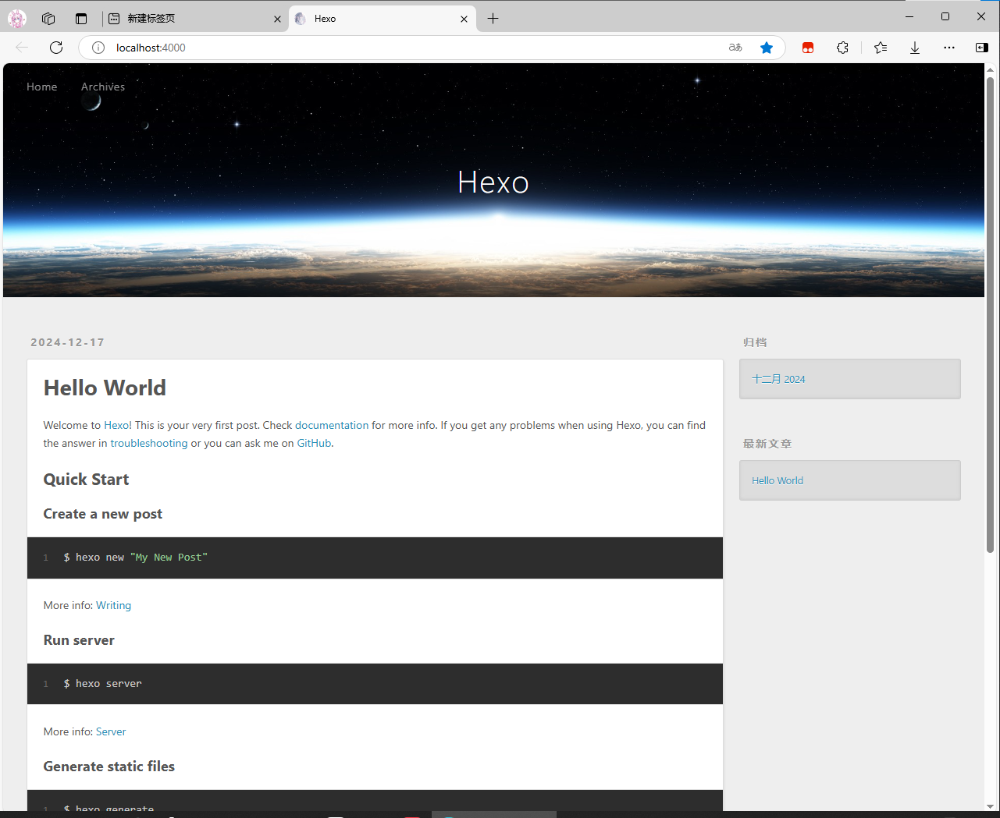

# 如何使用hexo搭建属于自己的个人博客

## 前面的碎碎念

写这篇文章的原因是因为自己第一次从0开始搭建博客，遇到了很多问题。而且官方文档里面有一些东西已经过时（截至2024年10月25日）~~（从这个日期你也可以看到这篇文章我咕咕咕了好长时间）~~，多平台搭建的时候需要注意的问题也不甚相同。

还是那句话，有任何问题请直接访问 [文档 | Hexo](https://hexo.io/zh-cn/docs/) ，我这个只是通俗易懂地把安装过程介绍给大家，并附上我的问题和解决方案。

## 安装hexo

hexo依赖Node.js和Git工作，如果你没有安装过这两个依赖，请按照下面的步骤安装

### Node.js

- Windows用户和macOS用户可以直接在Node.js的官网下载已经编译好的安装包，网址：[Node.js — 下载 Node.js®](https://nodejs.org/zh-cn/download/prebuilt-installer)

- Node.js没有为任何Linux发行版构筑安装包，因此大家可以通过包管理器安装。推荐使用fnm

  ```bash
  # 安装 fnm (快速 Node 管理器)
  curl -fsSL https://fnm.vercel.app/install | bash
  
  # 激活 fnm
  source ~/.bashrc
  
  # 下载并安装 Node.js 22
  fnm use --install-if-missing 22
  
  # 验证环境中是否存在正确的 Node.js 版本
  node -v # 应该打印 `v22.12.0`
  
  # 验证环境中是否存在正确的 npm 版本
  npm -v # 应该打印 `10.9.0`
  ```

- 如果你用的操作系统无法安装fnm，nvm，可以下载预构建二进制文件 [Node.js — 下载 Node.js®](https://nodejs.org/zh-cn/download/prebuilt-binaries) 然后自行编译（很费时间）

- 注意：不要使用snap安装Node.js，会很麻烦，还有很多bug

### Git

#### 传统的Git

- Windows直接下载对应的安装包即可 [Git - Downloads](https://git-scm.com/downloads)

- macOS需要先安装homebrew，之后运行

  ```shell
   brew install git
  ```

- Ubuntu可以直接使用apt安装

  ```shell
   add-apt-repository ppa:git-core/ppa
   apt update; apt install git
  ```

#### GitHub Desktop

如果你正在使用Windows或者macOS，可以试用一下Github Desktop，对后续管理项目很有用。

当然用Visual Studio Code也是可以的。（本人可能更喜欢GUI）

### hexo安装

打开终端，输入

```shell
npm install -g hexo-cli
```

在这一步你有可能会遇到如下问题：

.png)

这是因为你的windows安全策略设置成了严格模式，只需要使用如下命令（需要在管理员模式下运行）：

```shell
set-ExecutionPolicy RemoteSigned
```

在国内npm可能非常慢，可以使用阿里镜像源，只需要用以下命令

```shell
npm config set registry https://registry.npmmirror.com
npm config get registry
```

查看返回是不是 https://registry.npmmirror.com ，如果是，证明配置成功。

然后在终端中输入 hexo ，即可获得以下返回值



### 创建博客文件夹

1. 切换到你想创建博客本地文件的位置，直接输入

   ```shell
   hexo init hexo-sync
   ```

   hexo-sync是你的hexo配置文件夹的名字，可以改成其他的。不建议有除了下划线以外的其他特殊字符

   安装完成后应该显示

   ```powershell
   PS C:\Users\BiDonghui\Desktop> hexo init hexosync
   INFO  Cloning hexo-starter https://github.com/hexojs/hexo-starter.git
   INFO  Install dependencies
   INFO  Start blogging with Hexo!
   ```

   如果你的网络环境不好或者机器性能过差，会在如图所示的位置卡住很长时间，请等待至少10分钟，如果没有反应请按Ctrl+C取消并重试。（更换上述阿里源可以解决问题）

   

2. 使用 `cd` 切换到刚刚创建的`hexosync`文件夹，然后执行 `npm install`，npm会根据文件夹里面的 package.json 文件自动搜寻安装包安装插件

3. 输入`hexo`，可以发现终端输出如下，证明hexo部署成功

   

4. 上图中列出来了一些hexo常用命令，对我们来说，常用命令有如下几个

   ```
   hexo new xxxxx.md
   #创建新的文章，名字为xxxxx.md
   
   hexo s
   #启动本地服务器，你的博客就可以在 127.0.0.1:4000 查看了
   
   hexo clean
   #清除所有生成的public文件（不会清除你写的文章和配置，只是清除掉要往Github上面推送的文件）
   
   hexo g
   #生成Public文件夹，即Github Pages上面要显示的网页
   
   hexo d
   #将你的博客推送到Github Pages
   ```

### 配置hexo的config.yaml

**推荐下载Visual Studio Code并安装YAML插件，能够极大地提升编辑效率**

执行完上述创建博客文件夹步骤后，hexosync里面大概长这个样子



双击_config.yml，下面给大家以中文注释里面的每一条是什么，大家也可以直接拷贝替换掉原文件里面的内容（慎用，因为可能版本不一样，做好备份）

```yaml
# 网站部分配置
title: Hexo     # 网站标题，显示在浏览器标签上
subtitle: ''      # 网站副标题，显示在首页
description: ''  # 网站描述，被搜索引擎收录的时候会用到
keywords:      # 网站关键字，被搜索引擎收录的时候会用到
author: bisucrose  # 网站作者
language: zh-CN  # 网站语言，zh-CN 为简体中文
timezone: ''   # 时区，中国直接写 Asia/Shanghai

# URL
## 网站的 URL 地址，如果是 GitHub Page，设置为 'https://username.github.io/project'，用来生成文章的链接
url: http://example.com
permalink: :year/:month/:day/:title/    # 文章链接的格式，:year/:month/:day/:title/ 为年月日标题，例如 2019/01/01/hello-world/
permalink_defaults:   # 不知道干嘛用的
pretty_urls:  # 是否美化链接
  trailing_index: true # 是否在链接后面加上 index.html
  trailing_html: true # 是否在链接后面加上 .html

# Directory 目录，一般不需要动
source_dir: source
public_dir: public
tag_dir: tags
archive_dir: archives
category_dir: categories
code_dir: downloads/code
i18n_dir: :lang
skip_render:  # 不渲染的文件，放在 source 文件夹下，有时候网页认证会用到
 

# Writing 写作  一般不需要动
new_post_name: :title.md # 新文章的文件名
default_layout: post
titlecase: false # Transform title into titlecase
external_link:
  enable: true # Open external links in new tab
  field: site # Apply to the whole site
  exclude: ''
filename_case: 0
render_drafts: false
post_asset_folder: false
relative_link: false
future: true
syntax_highlighter: highlight.js  # 代码高亮，默认为 highlight.js，也可以设置为 prismjs
highlight:
  line_number: true
  auto_detect: false
  tab_replace: ''
  wrap: true
  hljs: false
prismjs:
  preprocess: true
  line_number: true
  tab_replace: ''

# 首页设置
# path: Root path for your blogs index page. (default = '') 首页路径，默认为空
# per_page: Posts displayed per page. (0 = disable pagination)  每页显示的文章数量，0 为不分页
# order_by: Posts order. (Order by date descending by default)  文章排序方式，默认为按日期降序


index_generator:
  path: ''
  per_page: 0
  order_by: -date

# Category & Tag
default_category: uncategorized
category_map:
tag_map:

# Metadata elements
## https://developer.mozilla.org/en-US/docs/Web/HTML/Element/meta
meta_generator: true

# Date / Time format
## Hexo uses Moment.js to parse and display date
## You can customize the date format as defined in
## http://momentjs.com/docs/#/displaying/format/
date_format: YYYY-MM-DD
time_format: HH:mm:ss
## updated_option supports 'mtime', 'date', 'empty'
updated_option: 'mtime'

# Pagination
## Set per_page to 0 to disable pagination
per_page: 10
pagination_dir: page

# Include / Exclude file(s)
## include:/exclude: options only apply to the 'source/' folder
include:
exclude:
ignore:

# Extensions
## Plugins: https://hexo.io/plugins/  插件设置
## Themes: https://hexo.io/themes/  主题设置
theme: landscape  # 主题设置，landscape 为 Hexo 默认主题

# Deployment  部署设置
## Docs: https://hexo.io/docs/one-command-deployment  部署文档
## 使用 hexo d 部署时，会根据下面的配置进行部署，下面会说明如何配置
deploy:
  type: ''

```


## 配置GitHub Pages

使用GitHub Pages是因为GitHub Pages **不要钱！！！**但是国内访问出奇的慢，还有很多bug。如果你有域名的话其实有更好的选择，比如Vercel。具体可以去看我的~~《GitHub博客访问过慢——用Vercel+域名实现低成本部署》~~（还没写，咕咕咕咕咕咕）

### 创建 Pages

1. 进入自己的GitHub主页，点击repositories，点击new创建一个新的库，名字叫 `用户名.github.io`


2. 检查一下Settings里面的Pages，确保设置和我一样

   

3. 返回code，记下来自己的项目网址

   

   

### deploy部分的配置

我只用过Git发布，故只介绍这个。先安装 hexo-deployer-git

```shell
npm install hexo-deployer-git --save
```

然后_config.yml的deploy处这样写

```yaml
deploy:
  type: git
  repo: <repository url> 
  # 这里写你刚刚记下来的网址，比如我是https://github.com/bisucrose/bisucrose2.github.io
  branch: main
```

至此配置完成，如果不需要更换主题的话博客就搭建好了。另一篇文章里面将会介绍如何更换为bamboo主题及注意事项

## 部署

1. 执行`hexo s`，访问 https://127.0.0.1:4000/ ，即可打开预览如图所示

   

   

2.  在发布之前，先执行`hexo g`生成public文件夹

3.  然后输入`hexo d`发布到GitHub，过段时间就可以在 https://username.github.io/ 上面看到自己的网页了

4.  要写新文章，可以使用 `hexo new` 创建新文章，新文章在 ./sources/_post/里面 

5.  如果执行`hexo d` 的时候出现错误，请先执行`hexo clean`，然后再`hexo g`,`hexo d`

## 问题解决

1. **npm的时候卡死了：**在国内npm可能非常慢，可以使用阿里镜像源，只需要用以下命令

   ```shell
   npm config set registry https://registry.npmmirror.com
   npm config get registry
   ```

   查看返回是不是 https://registry.npmmirror.com ，如果是，证明配置成功。再次执行命令即可

2. **`hexo d` 报错：**先检查网络环境然后重试，确保能连接上GitHub。如果执行`hexo d` 的时候出现错误，请先执行`hexo clean`，然后再`hexo g`,`hexo d`

3. **把hexosync工程文件挪走了以后，再次执行hexo命令提示没有找到怎么办：**终端切换到移动走的hexosync文件夹，然后执行`npm install`，npm会重新安装插件和依赖。

## 后面的碎碎念

第一次配置hexo踩了一大堆坑，而且尝试了在三端（macOS，ubuntu，Windows）上面都尝试配置了。虽然 [琉璃佬](https://github.com/glasswarm) 说了5分钟就可以配好，但是对于初次接触的小白来讲还是需要费点时间的。

hexo的配置相比于之前WordPress和宝塔面板已经简化了很多了，这些年来也在看着个人博客由兴转衰，可能是大家的生活节奏都更快了，也没有那么多精力去搭建，维护一个网站了。看着各大博客网站全都是广告，CSDN和知乎甚至看两眼就开始收费，心中很是愤懑。而另外一些平台例如小红书、小黑盒、酷安、抖音，这些快餐平台本身就不适合传播复杂知识。

对于我这个INFJ来讲，花一些钱，打造一方没有广告的净土，一个好看的平台，一个免费的知识库，即使一年的访问量寥寥无几，但是如果一个在互联网大海里寻找冷门知识的舵手突然发现，有前辈在当下满是AI烂文的海洋中自己花时间打造了一座精致的小岛，上面刚好有一些失传掉的知识；还有它的主人，在岛上独自一人听着自己喜欢的歌曲维护小岛的时候，一切便都是值得的……

歌曲在左下角，点一下就可以播放了，是我喜欢的《Yuki No Aru Machi》 （雪のある町）


