# 吉林大学入网指南

## 概述

你吉校园网使用月租制，即：每月扣费20元，每年计费10个月，共计200元，通过校园卡在 http://ip.jlu.edu.cn 上缴费。校园网不限流量，随意使用。

前卫南区和南岭校区基本实现全校覆盖，信号在新装修的楼宇和宿舍楼里会比较好，在空旷地带欠佳，不过相较于其他学校也已经很不错了。（详见文章最后的[碎碎念](#碎碎念)）

如果你只需要配置有线网络可以[点击跳转](#有线网络使用说明)

## 无线网络使用说明

### JLU.WiFi

支持三个设备同时登陆，使用网页认证，无论是手机，平板还是电脑，只要使用无线网络，我都建议大家使用JLU.WiFi

#### 移动设备（手机，平板的登录方法）

在无线网络界面点击JLU.WiFi即可连接，之后会有如下三种情况：

- 安卓系统应该会自动跳转至登录界面，如下图左所示。输入邮箱前半部分（不带”@mails.jlu.edu.cn”）和密码即可。忘记密码请移步[问题解决](#问题解决)
- 若没有跳转，你可能会在通知栏看到如下图中间所示的信息，点击即可跳转至登录页面
- 如果一不小心手欠把通知划掉了，或者你是iOS15以下的用户，也没关系。进入WiFi界面点击JLU.WiFi，就可以跳转到登录界面

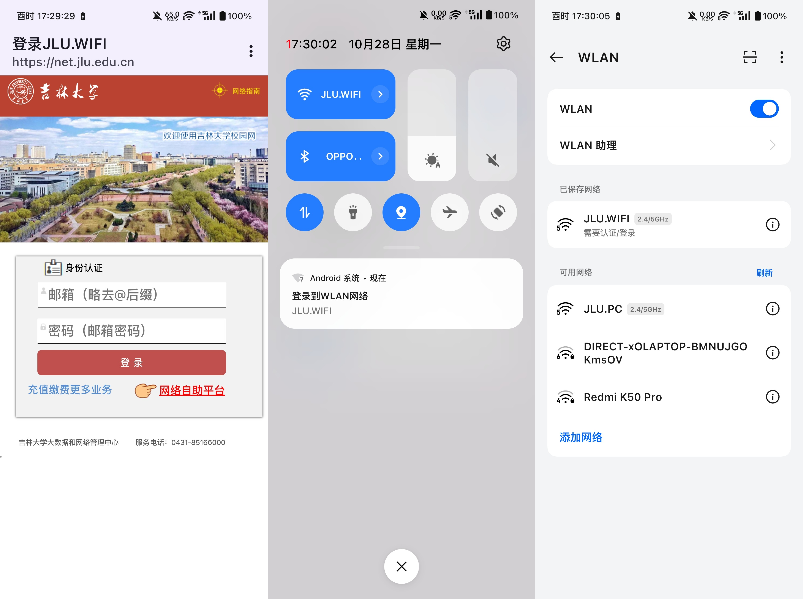

**注意：部分设备通知可能会出现延迟甚至根本不通知，如果遇到此类情况，请打开https://net.jlu.edu.cn/  即可进入登录界面。**

#### 电脑端

按照上述方法直接连接JLU.WiFi使用，有所不同的是电脑端大概率不会弹出登录界面，需要自己在浏览器输入https://net.jlu.edu.cn  ，登陆成功后稍等片刻，待通知栏正确显示WiFi标志后即可使用。

### JLU.PC

如果你加上电脑没有超过三个设备，非常不建议你使用JLU.PC，因为认证客户端已经是10年前的产物了，适配非常垃圾，启动速度很慢而且打开加速器以后还会经常掉线。

但是如果你和师哥一样，两个手机一个平板已经占用了JLU.WiFi的所有坑位，那么便只能使用JLU.PC了。使用方法如下：

0. 首先连接上JLU.PC，打开http://10.100.61.3/ 或者 http://login.jlu.edu.cn/  会出现如下界面

   

   

#### Windows端（如果你不知道你的系统是什么，那就是Windows）

点击下载Windows客户端，会得到一个名为drcom.exe的安装包，双击就会自动安装，之后会在桌面生成一个图标，叫做“吉林大学校园网认证客户端”，双击得到如下界面

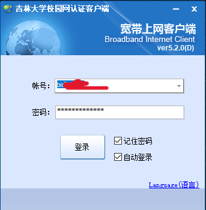

输入邮箱前半部分（不带”@mails.jlu.edu.cn”）和密码即可。建议勾选上记住密码和自动登录。忘记密码请移步[问题解决](#问题解决)

出现如下界面即为登陆成功

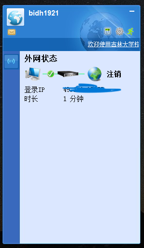

强烈建议日常使用JLU.PC的同学点击右上角设置，选择系统选项，勾选上开机时自动运行和登录后最小化到系统托盘。（若每次开机都出现弹窗，请移步[问题解决](#问题解决)查看解决方法）

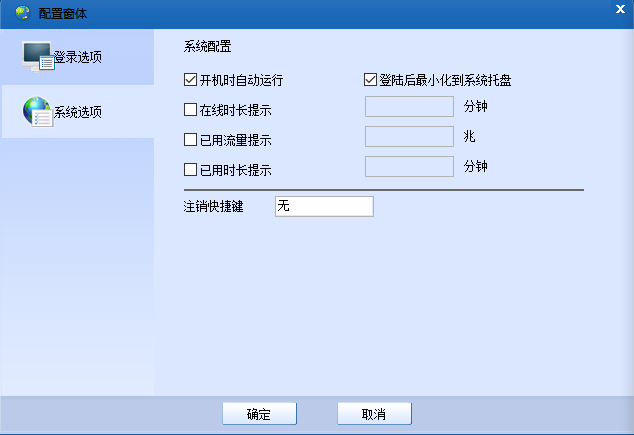

#### macOS端

- 打开http://login.jlu.edu.cn/

- 选择macOS客户端

- 下载页面给了点步骤，若你是在使用macOS Catalina, Big Sur, Monterey, Ventura, Sonoma以及之后的版本，请勿参考下载页面的步骤，因为已经好久没有更新了。

  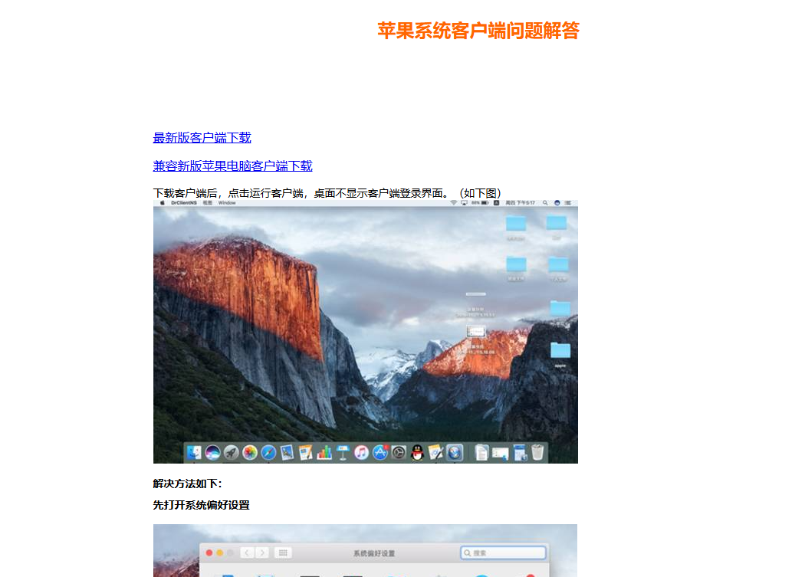

- 如果你是M1、M2、M3版本的mac，请下载兼容新版苹果电脑客户端，如果你是Intel处理器（2020年以前的macbook），请下载最新版客户端

- 在访达打开下载好的DrClientNS.dmg，拖入Application文件夹。

- 单击输入密码即可使用

#### Linux端~~（你都用Linux了应该不用我教了吧）~~

~~Linux用户可以跳过此段~~（雾）

鉴于有同学对Linux不熟悉又有日常使用Ubuntu开发的硬需求，在这里还是教一下比较好

**由于Linux系统更新飞快，认证客户端安装包内容也有变化，如有更新，请自行解决（2024年10月28日注）**

- 打开http://login.jlu.edu.cn/

- 点击Linux客户端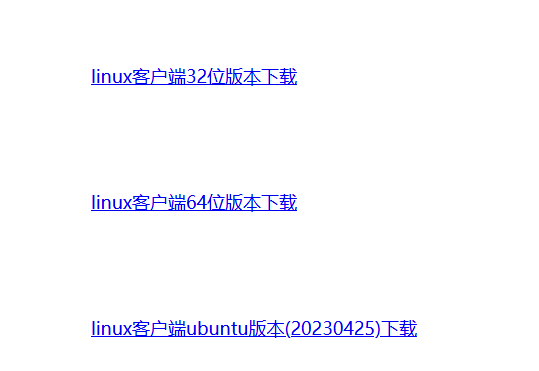

- 可以看到有3个版本，Ubuntu请下载最后一个，Arch，Deepin请下载第一个（其他的我没测试），下载后得到zip包，将其解压到桌面

- 打开终端，切换到桌面的Drcom文件夹（终端打开默认在`~$`的目录，切换目录的命令为`cd`，列出文件夹的内容的命令为`ls`）

- 然后输入以下命令来设置root密码，若已经设置，可以忽略

  ```shell
  sudo passwd
  ```

- 会显示以下内容：

  ```shell
  [sudo] password for bisucrose: #输入当前用户密码
  New password: #输入root新密码，请务必记得
  Retype new password: #再次输入root密码
  passwd: password updated successfully #密码更新成功
  ```

- 然后输入

  ```shell
  su
  ```

  出现`root@ubuntu:/home/bisucrose/Desktop/Drcom#`，即最后一个符号是#的时候，你就已经获取了root权限

- 然后输入

  ```shell
  sh privillege.sh
  ```

- 执行完毕后，双击文件夹中的DrClientLinux即可运行

## 有线网络使用说明

由于Linux不同系统间设置完全不同，macOS迭代速度也很快，故先只提供Windows系统的设置方法

### Windows系统的有线网络设置方法

1. 首先按下Win+S，搜索“设置”，点击“网络和Internet”

   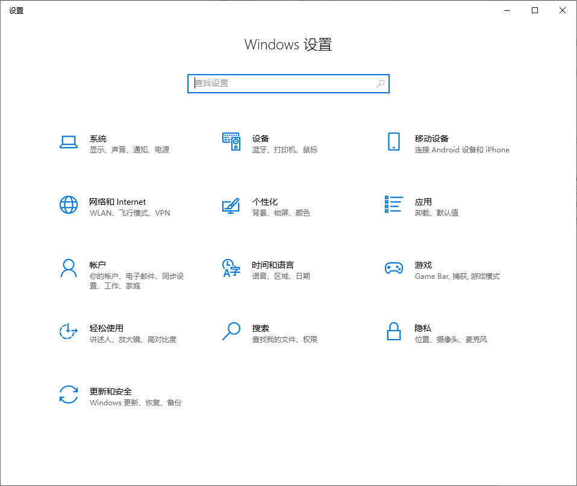

2. 点击“查看硬件和连接属性”

   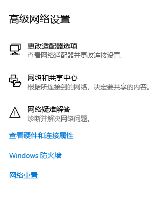

3. 找到名称为“以太网”的这一块，记下物理地址（一定是**以太网**）

   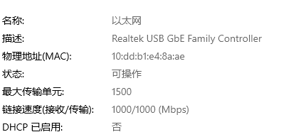

4. 先连接上JLU.PC，打开http://ip.jlu.edu.cn/pay/ 输入校园卡号和密码（默认为身份证后六位），登录，得到如下界面：

   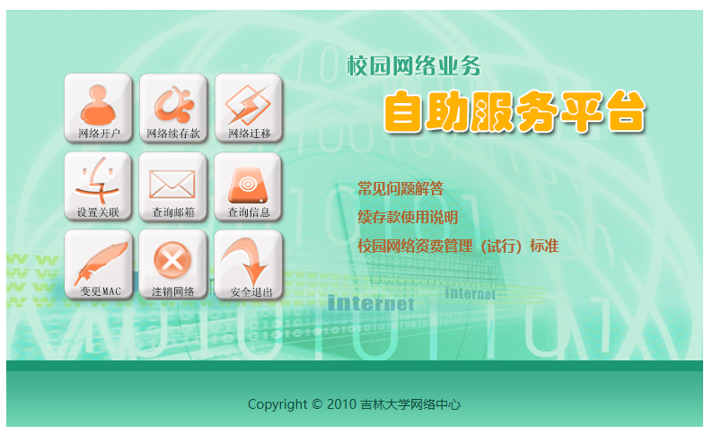

5. 新生选择网络开户，**老生可以跳到第8条**，保证校园卡里面还有120元以上的余额，信息正常填写，宿舍一定要选对。

6. **在网卡物理地址一栏填写自己刚刚记下的物理地址（MAC）**，如果暂时还没有电脑，可以全填00（**后续可以点击“变更MAC”来修改**）

7. 开户成功后，建议点击“查询邮箱”修改密码。

8. 然后点击查询信息->查看详细信息

   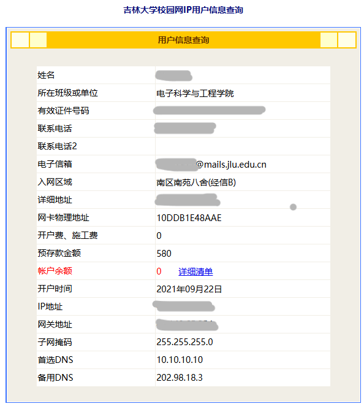

9. 同时Win+S搜索打开设置->网络和Internet，点击**以太网**，找到IP设置，点击编辑

   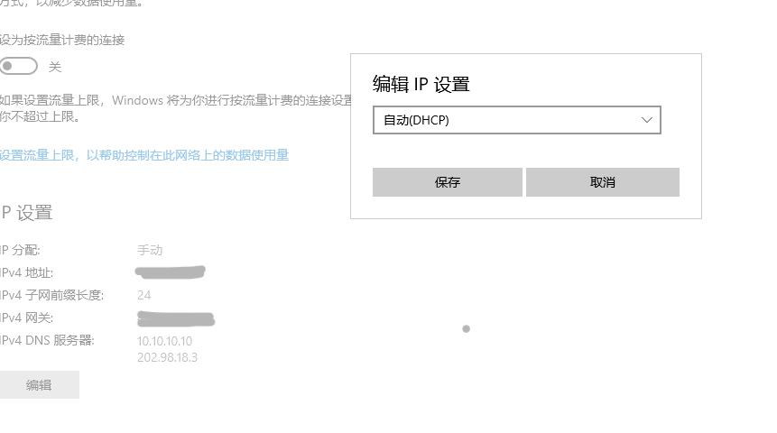

10. 将自动（DHCP）改为手动，启用IPV4，输入前面查到的对应信息。

11. **注意：Windows10用户“子网前缀长度”应为“24”，Windows11的“子网掩码”为“255.255.255.0”**

12. 设置完毕点击保存，然后按照上文[无线网络使用说明的JLU.PC使用说明](#Windows端（如果你不知道你的系统是什么，那就是Windows）)的方法正常登录认证即可。

## 问题解决

- Drcom有线网络MAC地址不匹配：请移步至[有线网络使用说明](#有线网络使用说明)第四条，选择变更MAC，检查和自己的网卡地址是否匹配。如果是KDE Plasma的Linux，目前就是有bug，可以试着把MAC地址按16进制+1或-1再试一下（MAC地址24小时内只能修改一次）

- 登录密码忘记：密码如果忘记了或者还没有设置可以进入http://ip.jlu.edu.cn/pay/ 重新设置, http://ip.jlu.edu.cn/pay/ 的账号是你的校园卡号，密码是你的身份证后六位。进入以后点击“查询邮箱”即可重新设置密码。

- 设置了开机启动以后每次出现弹窗：**请勿按照弹窗内指示设置，那个方法已经失效了喵！**

  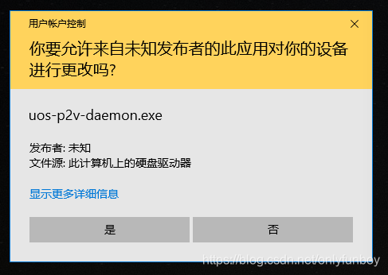

  点击“显示更多详细信息”->“选择何时显示通知”，直接改为“从不通知”

  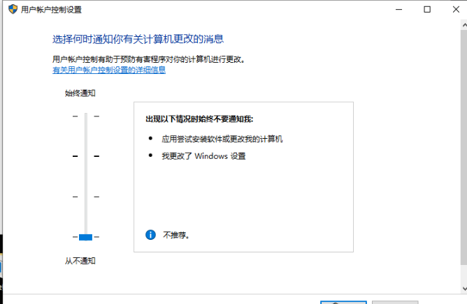

  因为师姐觉得这个没啥用。懂电脑的不会乱下载乱点APP，不懂电脑的小白看到这个窗口就点确定，不如给关了。

## 碎碎念

师姐在写这篇博客的时候也已经大四了，这四年基本耳边天天都能听到抱怨校园网垃圾的。但是后来去了一些学校的夏令营才发现，他们的校园网有的按照流量计费，每个月只有20GB流量（清华听说大家都不是很敢更新原神）；有的校园网速度极慢信号极差（北大的校园网有时候能给我限制到20KB/s）；还有的校园网屏蔽知乎，抖音，bilibili等平台。你吉在东北中心提供整个东北地区的校园网，延迟低、收费合理、速度已经是我见到的校园网中最快的了，而且时常能裸连Github和Steam商店。

所以没有对比就没有伤害。对了，你吉还买了不少正版软件可以供大家白嫖，网址是https://zbhrj.jlu.edu.cn/ 如果使用有问题可以加学校的QQ群联系客服，群号是：424287880 客服还是比较专业的

**也欢迎大家关注我的博客喵♡**

