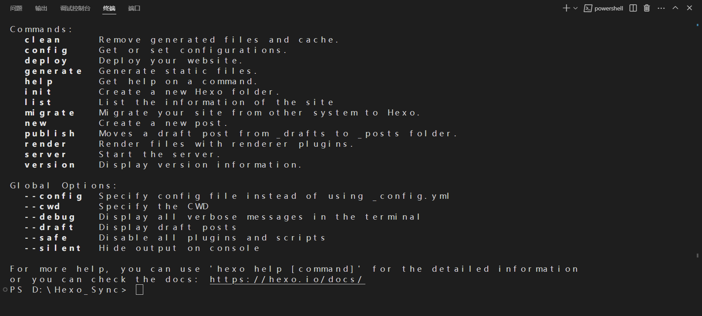
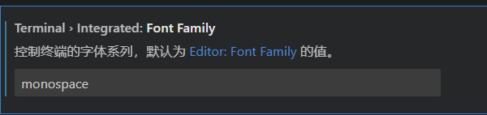
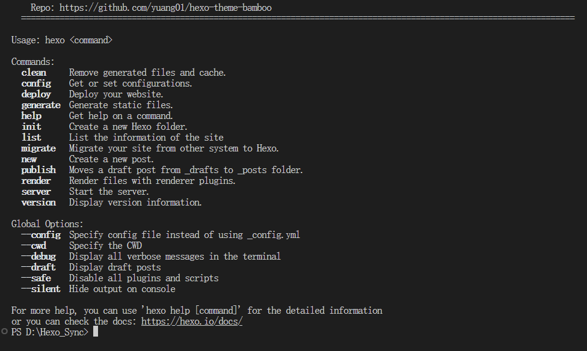
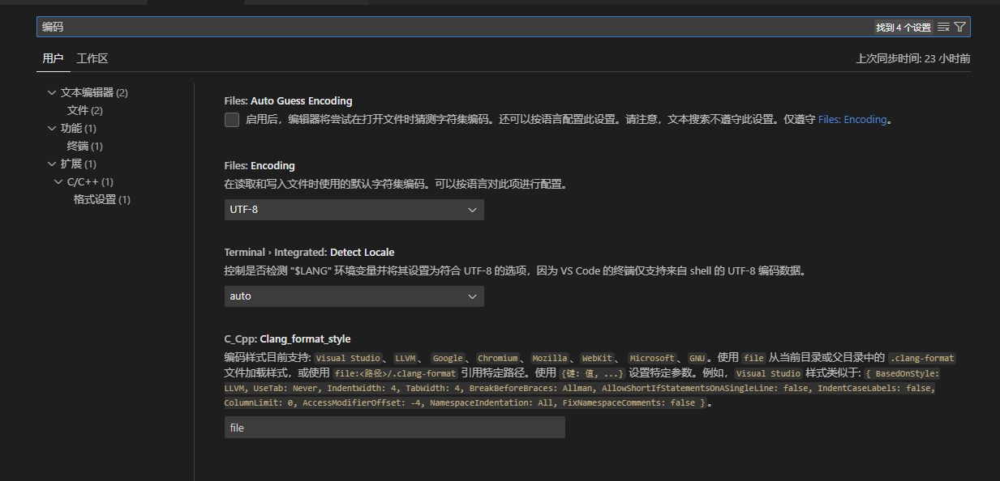

# Visual Studio Code终端字体&编辑器字体&中文编码配置

## 终端字体

在Visual Studio Code使用过程中，可以发现打开终端的时候，字体显示看起来比较恶心，如下图所示  

这是由于Visual Studio Code的终端为了兼容性只支持等宽字体，比如在macOS Sierra之前的版本，使用非等宽字体就会直接乱码，但是在更新的操作系统上已经不必担心此事。  

### 设置方法

点击左下角的“设置”图标，在搜索框键入：`终端 字体`，找到`Font Family`，键入`monospace`，这个是Visual Studio Code中自带的字体，替换后效果如下

## 编辑器字体

之前使用JetBrain系列的IDE感觉它的字体非常好看，辨识度也很高，可以将VSCode的编辑器也应用这种字体。

### 设置方法

先在电脑内安装JetBrain系列字体

下载地址：[JetBrains Mono: A free and open source typeface for developers | JetBrains: Developer Tools for Professionals and Teams](https://www.jetbrains.com/lp/mono/)

解压文件后打开ttf文件，并安装。

点击左下角的“设置”图标，在搜索框键入：`Editor：Font Family`，在搜索框内键入`JetBrains Mono, 'Courier New', monospace`即可

## 中文编码设置

默认的VSCode中文编码是UTF-8，而Keil的默认编码是GB2132，可以将VSCode的默认编码也设置为GBK（GB2132的扩展），这样就不用次次更改编码了

### 设置方法

点击左下角的“设置”图标，在搜索框键入：

上方搜索框输入`编码`，出现如下选项：

FIles:Encoding:下拉选择VS Code默认打开文件时选择的编码格式

Files:Auto Guess Encoding:VS Code会根据打开的文件自动猜测合适的编码格式并选择该格式打开文件，默认不开启，可以选择启用。

